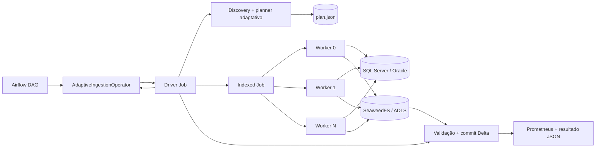

# Kubernetes Adaptive Ingestion Lab

Laboratório e referência arquitetural para ingestões SQL Server/Oracle → Delta
Lake executadas em Kubernetes. O repositório contém dois caminhos de execução:

- **motor Python adaptativo e distribuído**: um Driver Job descobre a origem,
  monta o plano e cria um Indexed Job com workers persistentes;
- **motor Spark**: uma imagem Spark gerenciada carrega um wheel de ingestão e é
  executada pelo Spark Kubernetes Operator.

O Airflow expõe ambos por operadores próprios. Minikube, bancos de benchmark,
SeaweedFS e observabilidade formam o laboratório local. AKS, ADLS Gen2 e Azure
Key Vault são os equivalentes previstos para produção; a integração Azure ainda
não está implementada ponta a ponta.

## Comece por aqui

| Quero... | Onde começar |
|---|---|
| Entender a arquitetura inteira | [RFC do motor adaptativo](docs/architecture/adaptive-ingestion-engine-rfc.md) |
| Encontrar um módulo no repositório | [Mapa de pastas](#mapa-do-repositório) |
| Criar uma DAG de ingestão | [DAG Oracle de exemplo](orchestration/airflow/dags/company_ingestion_oracle_adaptive.py) e [contrato de configuração](docs/reference/configuration.md) |
| Entender o operador Airflow | [AdaptiveIngestionOperator](orchestration/airflow/provider/src/company_airflow/operators/adaptive_ingestion.py) |
| Alterar discovery ou planejamento | [application/planning.py](engines/dlt/src/company_dlt_ingestion/application/planning.py) e [planner compartilhado](libraries/ingestion-core/src/company_ingestion_core/planner.py) |
| Implementar uma nova origem | [plugins/sources](engines/dlt/src/company_dlt_ingestion/plugins/sources) e [composition root](engines/dlt/src/company_dlt_ingestion/bootstrap/composition.py) |
| Alterar Parquet, Delta ou storage | [plugins](engines/dlt/src/company_dlt_ingestion/plugins) |
| Entender driver e workers | [driver.py](engines/dlt/src/company_dlt_ingestion/application/driver.py), [worker.py](engines/dlt/src/company_dlt_ingestion/application/worker.py) e [arquitetura distribuída](docs/architecture/distributed-driver-job.md) |
| Configurar Key Vault/identidade | [Autenticação no Azure Key Vault](docs/architecture/azure-key-vault-authentication.md) |
| Subir o laboratório | [Execução local](#execução-local) |
| Ver resultados já medidos | [Benchmarks](docs/benchmarks/results.md) e [E2E Airflow → Oracle → Delta](docs/benchmarks/adaptive-airflow-oracle-e2e.md) |
| Diagnosticar uma execução | [Observabilidade](docs/operations/observability.md) |

## Arquitetura em uma execução



O Airflow faz um único disparo e acompanha somente o Driver Job. O driver lê os
metadados da tabela, escolhe estratégia, chunking, `fetch_size` e paralelismo,
persiste o plano e cria os workers. Cada worker processa vários chunks; a
quantidade de pods é o paralelismo, não a quantidade de chunks. O publisher
valida contagem, promove os arquivos e cria a tabela Delta.

No modo Spark, o `CompanySparkOperator` cria uma `SparkApplication`; driver e
executores usam `CompanySparkRuntime` e carregam o wheel do job. Esse caminho
permanece separado do motor Python distribuído.

## Mapa do repositório

```text
k8s-ingestion/
├── engines/                       # runtimes e regras específicas de execução
│   ├── dlt/                       # motor Python adaptativo/distribuído
│   │   ├── src/company_dlt_ingestion/
│   │   │   ├── application/       # driver, worker, planejamento e estado
│   │   │   ├── bootstrap/         # entrypoint, registry e composição
│   │   │   ├── core/              # contratos e serialização estáveis
│   │   │   ├── plugins/           # fontes, encoder, storage e publisher
│   │   │   └── infrastructure/    # Kubernetes e métricas
│   │   ├── legacy/                # single-pod mantido para comparação
│   │   ├── tests/
│   │   ├── Dockerfile
│   │   └── pyproject.toml
│   └── spark/
│       ├── job/                   # wheel da ingestão Spark
│       ├── dependencies/          # coordenadas e lock dos JARs
│       ├── Dockerfile             # CompanySparkRuntime
│       └── launcher.py            # carrega wheel/entrypoint no driver Spark
├── libraries/
│   └── ingestion-core/            # modelos e algoritmos puros compartilhados
├── orchestration/
│   └── airflow/
│       ├── provider/              # operadores, hooks e triggers
│       ├── dags/                  # exemplos executáveis e benchmarks
│       └── Dockerfile
├── infrastructure/
│   └── local/
│       ├── kubernetes/            # manifests gerados do laboratório
│       ├── oracle/                # Oracle Free e fixture WIDE
│       └── sqlserver/             # SQL Server e fixtures small/medium/wide
├── tools/                         # bootstrap, build, seed, UI e relatórios
├── docs/
│   ├── architecture/              # decisões e desenhos do sistema
│   ├── benchmarks/                # metodologia e resultados medidos
│   ├── operations/                # execução e observabilidade
│   └── reference/                 # contratos e parâmetros atuais
├── Makefile                       # comandos de desenvolvimento
├── versions.env                   # catálogo de versões fixadas
└── requirements-dev.txt           # dependências das ferramentas locais
```

### Motor Python distribuído

| Área | Responsabilidade | Arquivos principais |
|---|---|---|
| Entrada | Seleciona `driver` ou `worker` | [bootstrap/entrypoint.py](engines/dlt/src/company_dlt_ingestion/bootstrap/entrypoint.py) |
| Composição | Registra e instancia plugins | [bootstrap/registry.py](engines/dlt/src/company_dlt_ingestion/bootstrap/registry.py), [bootstrap/composition.py](engines/dlt/src/company_dlt_ingestion/bootstrap/composition.py) |
| Configuração | Valida o contrato recebido da DAG | [application/config.py](engines/dlt/src/company_dlt_ingestion/application/config.py) |
| Driver | Coordena discovery, workers, validação e publicação | [application/driver.py](engines/dlt/src/company_dlt_ingestion/application/driver.py) |
| Planner | Converte metadados da origem em plano imutável | [application/planning.py](engines/dlt/src/company_dlt_ingestion/application/planning.py) |
| Worker | Resolve seus chunks e executa leitura/escrita | [application/worker.py](engines/dlt/src/company_dlt_ingestion/application/worker.py) |
| Estado | URIs e artefatos duráveis da execução | [application/state.py](engines/dlt/src/company_dlt_ingestion/application/state.py) |
| Contratos | Interfaces entre source, encoder, store e publisher | [core/contracts.py](engines/dlt/src/company_dlt_ingestion/core/contracts.py) |
| SQL Server | Catálogo, particionamento e leitura Arrow | [plugins/sources/sqlserver.py](engines/dlt/src/company_dlt_ingestion/plugins/sources/sqlserver.py), [sqlserver_arrow.py](engines/dlt/src/company_dlt_ingestion/plugins/sources/sqlserver_arrow.py) |
| Oracle | Discovery, `AS OF SCN` e `fetch_df_batches()` | [plugins/sources/oracle.py](engines/dlt/src/company_dlt_ingestion/plugins/sources/oracle.py) |
| Encoder | Arrow → Parquet pelo pipeline dlt | [plugins/encoders/dlt_parquet.py](engines/dlt/src/company_dlt_ingestion/plugins/encoders/dlt_parquet.py) |
| Object store | Operações S3 compatíveis | [plugins/stores/s3.py](engines/dlt/src/company_dlt_ingestion/plugins/stores/s3.py) |
| Publisher | Validação e commit Delta | [plugins/publishers/delta.py](engines/dlt/src/company_dlt_ingestion/plugins/publishers/delta.py) |
| Kubernetes | Manifesto e acompanhamento do Indexed Job | [infrastructure/kubernetes.py](engines/dlt/src/company_dlt_ingestion/infrastructure/kubernetes.py) |
| Métricas | Publicação das métricas da execução | [infrastructure/metrics.py](engines/dlt/src/company_dlt_ingestion/infrastructure/metrics.py) |

Para adicionar uma origem, implemente os contratos em `plugins/sources`,
registre o adapter no `bootstrap/registry.py` e adicione testes. O driver, o
worker e o operador Airflow não devem receber `if source == ...`.

### Airflow

| Área | Responsabilidade | Arquivo |
|---|---|---|
| Interface recomendada | Cria e acompanha um Driver Job deferrable | [operators/adaptive_ingestion.py](orchestration/airflow/provider/src/company_airflow/operators/adaptive_ingestion.py) |
| Contrato de ingestão | Monta configuração compartilhada entre driver/workers | [ingestion.py](orchestration/airflow/provider/src/company_airflow/ingestion.py) |
| Spark | Cria `SparkApplication` | [operators/spark.py](orchestration/airflow/provider/src/company_airflow/operators/spark.py) |
| Job genérico | Executa uma imagem como `batch/v1 Job` | [operators/enterprise_k8s.py](orchestration/airflow/provider/src/company_airflow/operators/enterprise_k8s.py) |
| Compatibilidade anterior | Wrapper do driver sobre o operador genérico | [operators/enterprise_ingestion.py](orchestration/airflow/provider/src/company_airflow/operators/enterprise_ingestion.py) |
| Espera assíncrona | Libera o worker Airflow enquanto o Job executa | [triggers](orchestration/airflow/provider/src/company_airflow/triggers) |

O `AdaptiveIngestionOperator` é a interface indicada para novas DAGs. Ele
estende o `KubernetesJobOperator`, gera um nome estável por execução, referencia
Kubernetes Secrets sem copiar valores e retorna a URI do resultado durável.

### Infraestrutura e arquivos gerados

Edite os geradores, não apenas o YAML resultante:

| Artefato | Fonte |
|---|---|
| `infrastructure/local/kubernetes/platform.yaml` | [tools/render-platform.py](tools/render-platform.py) |
| `infrastructure/local/kubernetes/observability/manifests.yaml` | [tools/render-observability.py](tools/render-observability.py) |
| `infrastructure/local/oracle/lab.yaml` | [tools/render-oracle-lab.py](tools/render-oracle-lab.py) |

`.local/`, `.tools/`, `.venv/`, `dist/`, `build/`, `*.egg-info` e caches são
estado ou artefatos locais e não fazem parte da arquitetura do produto.

## Catálogo de DAGs

| DAG | Caminho | Finalidade |
|---|---|---|
| `company_ingestion_oracle_adaptive` | [arquivo](orchestration/airflow/dags/company_ingestion_oracle_adaptive.py) | Oracle WIDE → Delta pelo `AdaptiveIngestionOperator`; exemplo recomendado. |
| `company_ingestion_dlt_distributed` | [arquivo](orchestration/airflow/dags/company_ingestion_dlt_distributed.py) | SQL Server → Delta com Driver Job e workers persistentes. |
| `company_ingestion_benchmark` | [arquivo](orchestration/airflow/dags/company_ingestion_benchmark.py) | SQL Server → Delta pelo motor Spark. |
| `company_ingestion_dlt_benchmark` | [arquivo](orchestration/airflow/dags/company_ingestion_dlt_benchmark.py) | Benchmark legado single-pod pelo Job genérico. |

Para criar uma DAG produtiva, use uma das duas primeiras como base e consulte
[todos os parâmetros do operador e do motor](docs/reference/configuration.md).

## Execução local

### Laboratório completo

Em um host Ubuntu/Debian novo:

```bash
make host-setup
```

O setup instala/configura Docker e adiciona o usuário ao grupo `docker`. Abra um
novo terminal depois da primeira execução. Em seguida:

```bash
make local-up   # Minikube, bancos, storage, Airflow e observabilidade
make ui         # cria/restaura os port-forwards em 127.0.0.1
make status     # mostra pods, Jobs e SparkApplications
```

`make local-up` constrói as imagens locais, carrega-as no Minikube, aplica os
manifests, cria buckets e popula as fixtures SQL Server.

### E2E Oracle mínimo

Para testar somente Oracle → motor distribuído → Delta, sem Airflow ou Spark:

```bash
bash tools/bootstrap-oracle-e2e.sh
```

O padrão cria `BENCHMARK.WIDE` com 1 milhão de linhas e 48 colunas. Para variar:

```bash
ROWS=2000000 WORKERS=8 bash tools/bootstrap-oracle-e2e.sh
```

Depois do bootstrap, as etapas podem ser repetidas separadamente:

```bash
make oracle-up
make oracle-seed
make oracle-e2e
```

## Interfaces locais

Todas as interfaces são expostas apenas em `127.0.0.1` por `make ui`.

| Componente | Endereço | Uso |
|---|---|---|
| Airflow | http://localhost:8080 | Disparar DAGs e acompanhar tasks/logs |
| Grafana | http://localhost:3000/d/company-spark | Comparar throughput, duração e recursos |
| Kubernetes Dashboard | http://localhost:8001 | Pods, Jobs, CPU, memória e eventos |
| Spark Live UI | http://localhost:4040 | Execução Spark ativa; só existe enquanto o driver está rodando |
| Spark History Server | http://localhost:18080 | Aplicações Spark concluídas |
| Prometheus | http://localhost:9090 | PromQL e séries brutas |
| Pushgateway | http://localhost:9091 | Métricas publicadas por execução |
| SeaweedFS Filer | http://localhost:8888 | Navegação dos arquivos |
| SeaweedFS S3 | `http://localhost:8333` | API S3 autenticada; não é interface web |
| SQL Server | `localhost:1433` | SSMS, DBeaver ou `sqlcmd` |
| Oracle Free | `localhost:1521/FREEPDB1` | DBeaver, SQLcl ou SQL*Plus |

O SeaweedFS responde `AccessDenied` quando a porta S3 é aberta no navegador,
pois a requisição não tem assinatura. Use o Filer ou um cliente S3.

## Credenciais locais

As senhas são geradas uma vez por [tools/configure-secrets.py](tools/configure-secrets.py)
e armazenadas em `.local/credentials.json` com permissão `0600`. O arquivo é
ignorado pelo Git. Airflow e Grafana usam o usuário `admin`; SQL Server usa
`ingestion` no banco `Benchmark`; Oracle usa `benchmark` no serviço `FREEPDB1`.

Consulte somente a credencial necessária:

```bash
jq -r '.airflow' .local/credentials.json
jq -r '.grafana' .local/credentials.json
jq -r '.sqlserver_ingestion' .local/credentials.json
jq -r '.oracle_ingestion' .local/credentials.json
```

Em produção, credenciais de origem devem ser resolvidas pelo runtime. A decisão,
as diferenças entre Workload Identity e Service Principal e os requisitos de
AKS estão em [Autenticação no Azure Key Vault](docs/architecture/azure-key-vault-authentication.md).

## Comandos de desenvolvimento

| Comando | Efeito |
|---|---|
| `make test` | Testa núcleo, motores e provider Airflow. |
| `make core-build` | Gera o wheel de `ingestion-core` em `dist/`. |
| `make spark-job-build` | Gera o wheel da ingestão Spark. |
| `make dlt-package-build` | Gera o wheel do motor Python. |
| `make runtime-build` | Constrói/carrega `company-spark-runtime`. |
| `make dlt-build` | Constrói/carrega `company-dlt-ingestion`. |
| `make airflow-build` | Constrói/carrega o Airflow com provider e DAGs. |
| `make artifacts-publish` | Publica o wheel Spark no servidor de artefatos local. |
| `make seed` | Recria as fixtures SQL Server. |
| `make benchmark-report` | Regenera o relatório a partir dos resultados no storage. |
| `make metrics-replay` | Republica métricas Spark persistidas. |
| `make spark-ui APPLICATION=<nome>` | Conecta `localhost:4040` a um driver Spark ativo. |
| `make local-stop` | Para o perfil Minikube `company-spark`. |

Para observar diretamente pelo terminal:

```bash
.tools/bin/kubectl --context company-spark -n spark-lab get pods,jobs -w
.tools/bin/kubectl --context company-spark -n spark-lab get sparkapplications -w
.tools/bin/kubectl --context company-spark top pods -n spark-lab
```

## Dados e resultados

Cada execução recebe um `run_id` e grava em um prefixo próprio. Os principais
caminhos locais são:

| Conteúdo | Prefixo |
|---|---|
| Delta pelo Spark | `s3a://lakehouse/bronze/<tabela>/<run_id>` |
| Delta distribuído SQL Server | `s3://lakehouse/dlt-distributed/bronze/<tabela>/<run_id>` |
| Delta distribuído Oracle | `s3://lakehouse/oracle-airflow/bronze/wide/<run_id>` |
| Estado do driver | `s3://ingestion-control/runs/<run_id>` |
| Métricas Spark | `s3a://metrics/runs/` |
| Métricas distribuídas | `s3://metrics/runs-dlt-distributed/` |
| Event logs Spark | `s3a://spark-events/` |

O `result.json`, os manifests por chunk e o log `COMPANY_INGESTION_RESULT=...`
contêm contagem de linhas, bytes, arquivos, throughput, retries, plano e duração
por fase.

## Documentação por assunto

### Arquitetura

- [RFC do motor adaptativo e distribuído](docs/architecture/adaptive-ingestion-engine-rfc.md)
- [Arquitetura composável e plugins](docs/architecture/composable-ingestion-engine.md)
- [Driver Job e Indexed Job](docs/architecture/distributed-driver-job.md)
- [Oracle colunar e distribuído](docs/architecture/oracle-columnar-ingestion.md)
- [Azure Key Vault e identidades](docs/architecture/azure-key-vault-authentication.md)
- [Organização detalhada do repositório](docs/architecture/repository-layout.md)

### Contratos e operação

- [Parâmetros de operadores e motores](docs/reference/configuration.md)
- [Observabilidade, interfaces e logs](docs/operations/observability.md)

### Benchmarks

- [Resultados consolidados](docs/benchmarks/results.md)
- [Spark × motor Python](docs/benchmarks/spark-dlt-comparison.md)
- [E2E AdaptiveIngestionOperator com Oracle](docs/benchmarks/adaptive-airflow-oracle-e2e.md)

## Estado atual

Implementado e validado localmente:

- SQL Server com leitura Arrow pelo `mssql-python`;
- Oracle com `python-oracledb.fetch_df_batches()` e snapshot `AS OF SCN`;
- planner adaptativo, chunks duráveis e workers persistentes;
- publicação Delta zero-copy sobre S3 compatível;
- `AdaptiveIngestionOperator` sobre `KubernetesJobOperator`;
- E2E Airflow → Driver Job → quatro workers → Oracle → Delta → Airflow success.

Pendências produtivas principais:

- `SecretResolver` do Azure Key Vault;
- `ArtifactStore` ADLS Gen2;
- Workload Identity validada em AKS real;
- policies, quotas e limpeza produtiva;
- consistência forte SQL Server e concorrência de commits Delta.

O estado detalhado e os critérios de aceite ficam no
[RFC](docs/architecture/adaptive-ingestion-engine-rfc.md).
