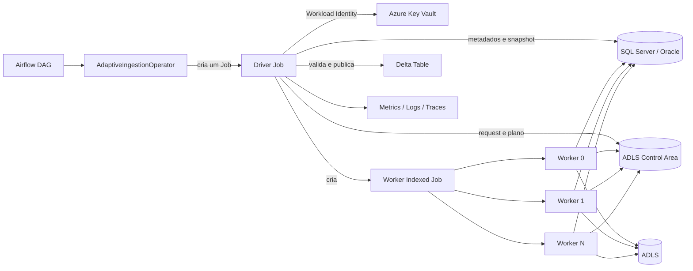
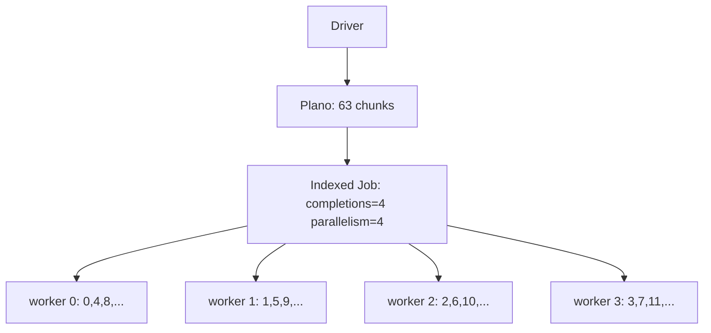
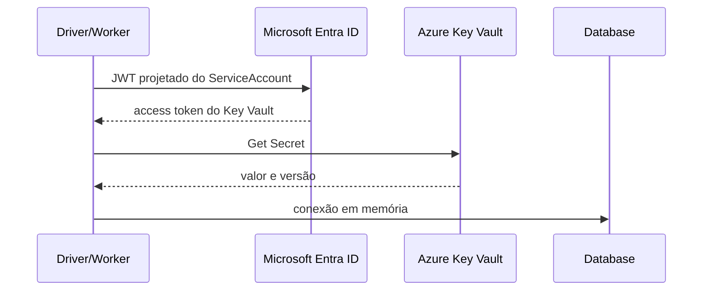

# RFC — Motor adaptativo e distribuído de ingestão

| Campo | Valor |
|---|---|
| Status | Proposta aceita para evolução incremental |
| Escopo inicial | Snapshots SQL Server e Oracle para Parquet/Delta Lake |
| Orquestração | Apache Airflow |
| Runtime | Kubernetes/AKS |
| Persistência produtiva | ADLS Gen2 |
| Gestão de segredos produtiva | Azure Key Vault + Microsoft Entra Workload ID |

## 1. Resumo

O motor é uma plataforma especializada em movimentação de grandes volumes de
dados tabulares. Ele recebe uma intenção declarativa de ingestão, inspeciona a
origem, constrói automaticamente um plano de leitura, distribui o plano entre
workers no Kubernetes e publica o resultado em armazenamento de objetos.

O autor da DAG informa qual objeto deve ser ingerido e qual política de execução
utilizar. Ele não precisa definir coluna de particionamento, limites, número de
partições, `fetch_size`, quantidade de chunks, pods, comandos Kubernetes ou
credenciais do banco.

O produto não é um substituto geral de Spark ou Databricks. Seu foco é o caminho
especializado:

```text
banco relacional
    → leitura colunar
    → Parquet
    → landing ou Delta Lake
```

Transformações complexas, joins distribuídos, machine learning e processamento
SQL analítico geral continuam sendo workloads adequados para Spark.

## 2. Objetivos e invariantes

1. Uma execução possui seu próprio Driver Job.
2. O Airflow dispara uma única unidade de execução.
3. O Airflow não consulta a origem e não recebe suas credenciais.
4. O driver descobre a origem e persiste um plano imutável.
5. Um conjunto fixo de workers processa vários chunks.
6. Quantidade de chunks e quantidade de pods são conceitos independentes.
7. Batches colunares Arrow atravessam o data plane.
8. Credenciais são resolvidas somente em tempo de execução.
9. O estado de recuperação fica em object storage.
10. A execução de chunks é pelo menos uma vez; a publicação deve ser idempotente.
11. Origens, encoders, stores e publishers são adapters substituíveis.
12. Não existe serviço central permanente coordenando todas as ingestões.

## 3. Contexto do sistema



O Airflow acompanha o Driver Job. O driver encapsula a topologia de workers e
permanece responsável até a publicação. Driver e workers são Jobs efêmeros; o
motor não exige um `Deployment` permanentemente ativo.

## 4. Fronteiras do produto

| Componente | Responsabilidade |
|---|---|
| Engine core | Contratos, planejamento, estados e casos de uso |
| Source adapters | SQL Server, Oracle e futuras origens |
| Batch encoders | Arrow para Parquet |
| Artifact stores | SeaweedFS/S3 no laboratório, ADLS em produção |
| Publishers | Landing Parquet, Delta Lake e futuros destinos |
| Kubernetes runtime | Driver, workers e Indexed Job |
| Runtime image | Python, wheel, drivers e dependências aprovadas |
| Airflow provider | Interface declarativa para DAGs |
| Infraestrutura | AKS, ACR, ADLS, Key Vault, rede e observabilidade |

O wheel contém a inteligência do motor. Uma imagem corporativa contém o wheel e
suas dependências. Uma nova tabela não exige uma nova imagem.

```text
Runtime image
├── Python runtime
├── engine wheel
├── mssql-python
├── python-oracledb
├── PyArrow
├── delta-rs
├── cliente Kubernetes
└── Azure Identity e Key Vault SDK
```

## 5. Contrato de entrada

A DAG envia referências e intenção, sem valores secretos:

```json
{
  "apiVersion": "ingestion.company/v1",
  "source": {
    "profile": "finance-oracle-prod",
    "type": "oracle",
    "schema": "FINANCE",
    "table": "ORDERS"
  },
  "destination": {
    "profile": "corporate-landing-prod",
    "path": "finance/orders",
    "format": "delta"
  },
  "policy": {
    "computeProfile": "wide-large",
    "loadMode": "snapshot"
  }
}
```

Um profile administrado pela plataforma resolve os detalhes operacionais:

```yaml
finance-oracle-prod:
  type: oracle
  host: oracle.internal.company
  port: 1521
  service_name: FINPRD
  secret:
    provider: azure-key-vault
    vault_url: https://kv-ingestion-prod.vault.azure.net
    name: finance-oracle-readonly
  limits:
    max_connections: 16
    query_timeout_seconds: 1800
```

O operador público não deve aceitar imagem, comando, ServiceAccount, namespace,
`hostPath`, volumes ou variáveis arbitrárias para autores comuns de DAG. Esses
campos são controlados por profiles da plataforma para que o operador não se
torne um executor irrestrito de containers.

## 6. Arquitetura interna e extensibilidade

O core depende de capacidades, não de vendors:

```python
class SourceCatalog(Protocol):
    def discover(self, source) -> TableMetadata: ...

class SnapshotProvider(Protocol):
    def capture(self, source) -> SnapshotBoundary: ...

class PartitionPlanner(Protocol):
    def plan(self, metadata, snapshot, policy) -> ReadPlan: ...

class BatchReader(Protocol):
    def batches(self, chunk, fetch_size) -> Iterable[RecordBatch]: ...

class BatchEncoder(Protocol):
    def encode(self, batches, output) -> EncodedArtifact: ...

class ArtifactStore(Protocol):
    def create_immutable(self, uri, value): ...

class Publisher(Protocol):
    def publish(self, plan, manifests): ...

class SecretResolver(Protocol):
    def resolve(self, reference) -> SourceCredential: ...
```

O composition root seleciona implementações:

```text
source=sqlserver → SqlServerCatalog → MssqlArrowReader
source=oracle    → OracleCatalog    → OracleArrowReader
encoder=dlt      → DltParquetEncoder
encoder=pyarrow  → PyArrowParquetEncoder
store=adls       → AdlsArtifactStore
publisher=delta  → DeltaPublisher
```

O estado atual já possui contratos para catalog, partitioner, reader, encoder,
store e publisher. `SnapshotProvider` e `SecretResolver` são extensões necessárias
para separar completamente consistência e credenciais dos adapters atuais.

## 7. Data plane colunar

### 7.1 Custo do caminho orientado a linhas

```text
wire protocol
    → DB-API Row
    → objeto Python por célula
    → dict por linha
    → lista de dicts
    → normalização
    → Arrow
    → Parquet
```

Uma tabela com 300 milhões de linhas e 50 colunas pode criar bilhões de objetos
temporários. O custo inclui alocação, referências, conversões, garbage
collection e baixa localidade de cache. SQLAlchemy permanece útil para consultas
pequenas de catálogo, mas não deve atravessar o data plane.

### 7.2 Arrow e o significado de zero-copy

Arrow representa uma coluna primitiva com buffers de valores e validade. Strings
usam offsets e um buffer contíguo de dados. O layout completo é definido na
[especificação colunar do Arrow](https://arrow.apache.org/docs/format/Columnar.html).

```text
INT64:  validity bitmap + values buffer
STRING: validity bitmap + offsets + data buffer
```

Zero-copy significa que um consumidor reutiliza buffers Arrow já construídos,
sem recriar cada célula como objeto Python. Não elimina:

- leitura da rede;
- decodificação TDS ou Oracle Net;
- alocação dos buffers iniciais;
- encoding e compressão Parquet;
- upload para object storage.

Arrow é o formato de memória. Parquet é o formato persistente e ainda precisa
formar row groups, páginas, estatísticas, dictionary encoding e compressão. O
[`ParquetWriter`](https://arrow.apache.org/docs/python/generated/pyarrow.parquet.ParquetWriter.html)
permite fazer isso incrementalmente sobre RecordBatches.

## 8. SQL Server com mssql-python

`mssql-python` converte resultados ODBC diretamente para Arrow na camada C++ e
`arrow_reader()` entrega batches incrementais, evitando Rows e dicts Python. A
[integração Arrow oficial](https://learn.microsoft.com/en-us/sql/connect/python/mssql-python/arrow-integration?view=sql-server-ver16)
descreve o caminho.

```text
SQL Server/TDS → DDBC/ODBC → buffers Arrow → RecordBatchReader → Parquet
```

Vantagens:

- data plane sem SQLAlchemy Row;
- streaming limitado por batch;
- menor pressão de memória e garbage collector;
- autenticação Microsoft Entra;
- pooling embutido;
- distribuição e suporte Microsoft.

Trade-offs:

- tipos precisam de uma matriz de compatibilidade;
- wheels e arquitetura de CPU precisam ser testados;
- pooling é local ao processo;
- tokens não são renovados dentro de uma conexão física já aberta;
- se banco ou rede forem o gargalo, Arrow reduz CPU sem aumentar a origem.

Para Azure SQL, a preferência é autenticação Entra sem senha. O driver aceita
`token_provider` e modos Entra; a
[documentação de autenticação](https://learn.microsoft.com/en-us/sql/connect/python/mssql-python/entra-authentication?view=sql-server-ver16)
inclui Workload Identity na cadeia padrão. Em produção, um credential explícito
evita percorrer providers desnecessários.

O usuário de leitura precisa de `SELECT` e visibilidade dos metadados. A DMV
`sys.dm_db_partition_stats` exige permissões adicionais de estado/definição do
banco, que variam por versão. Consulte as
[permissões oficiais](https://learn.microsoft.com/en-us/sql/relational-databases/system-dynamic-management-objects/sys-dm-db-partition-stats-transact-sql?view=sql-server-ver17).
Sem essas permissões, o planner deve degradar a estimativa em vez de exigir um
usuário administrativo.

## 9. Oracle com python-oracledb

`fetch_df_batches()` constrói DataFrames com nanoarrow e os expõe por
`ArrowArrayStream` PyCapsule. PyArrow consome esses buffers sem passar por listas
de objetos Python. Veja
[DataFrames no python-oracledb](https://python-oracledb.readthedocs.io/en/latest/user_guide/dataframes.html)
e a [interface PyCapsule](https://arrow.apache.org/docs/format/CDataInterface/PyCapsuleInterface.html).

```text
Oracle Net → python-oracledb/nanoarrow → PyCapsule → PyArrow → Parquet
```

Thin mode é o baseline porque não exige Oracle Client, reduz a imagem e atende
Oracle 12.1 ou superior. Thick mode deve ser um runtime alternativo para casos
como Oracle 11.2, Native Network Encryption específico, Application Continuity,
Transparent Application Continuity ou Runtime Load Balancing. Esses requisitos
estão na [documentação Thin/Thick](https://python-oracledb.readthedocs.io/en/latest/user_guide/initialization.html).

Thick mode aumenta a matriz de testes, o tamanho da imagem, a superfície de
patch e exige revisão da redistribuição do Instant Client. Ele não deve ser
adotado apenas pela expectativa de melhor throughput; Thin e Thick precisam ser
comparados contra o banco e rede produtivos.

O `size` de `fetch_df_batches()` também define `arraysize` e `prefetchrows`.
Batches maiores reduzem round trips e elevam memória. O planner deve calcular o
tamanho inicial e os workers podem recalibrá-lo a partir dos primeiros
`RecordBatch.nbytes`.

### Snapshot Oracle

O driver captura um SCN e todos os chunks usam:

```sql
SELECT ...
FROM schema.table AS OF SCN :snapshot_scn
WHERE <chunk predicate>
```

Isso fornece uma fronteira comum entre workers, desde que o undo seja retido por
toda a execução. A identidade precisa de `SELECT`/`READ`, `FLASHBACK` no objeto e
`EXECUTE` em `DBMS_FLASHBACK`; veja
[Oracle Flashback Technology](https://docs.oracle.com/en/database/oracle/oracle-database/26/adfns/flashback.html).

## 10. Consistência no SQL Server

Este é um requisito ainda aberto para produção. Cada worker possui sua própria
conexão. Transações `SNAPSHOT` iniciadas em instantes distintos não formam um
snapshot global equivalente ao SCN do Oracle.

As políticas possíveis são:

1. uma conexão única para consistência transacional;
2. réplica ou snapshot operacional imutável;
3. watermark em tabelas estritamente append-only;
4. consistência best-effort declarada;
5. integração com CDC;
6. reconciliação posterior.

`rowversion <= limite` não reconstrói versões antigas de updates e não recupera
deletes. O plano deve registrar a garantia real:

```json
{"snapshot":{"mode":"oracle_scn","value":123,"consistency":"point_in_time"}}
```

ou:

```json
{"snapshot":{"mode":"sqlserver_best_effort","consistency":"non_atomic_parallel_read"}}
```

## 11. Planner adaptativo

O planner recebe quantidade e bytes estimados, largura média, tipos, índices,
histogramas, bounds, limite de conexões e recursos da plataforma.

### Seleção da chave

Ele prioriza a primeira coluna de um índice utilizável, numérica ou temporal,
dando preferência a clustered, unique, primary key e `NOT NULL`. Sem chave
segura, executa um scan. Gerar vários predicates de hash sobre uma heap poderia
provocar múltiplos full scans.

### Ranges

Histogramas produzem quantis com carga semelhante. Sem histograma, o fallback
interpola entre mínimo e máximo. Os predicates são disjuntos e cobrem o domínio:

```sql
key < b1 OR key IS NULL
key >= b1 AND key < b2
key >= b2
```

Estatísticas podem estar amostradas ou antigas. Elas influenciam balanceamento,
mas não podem limitar as extremidades e comprometer completude.

### Chunks e workers

O baseline atual usa:

```text
preferred_chunk_bytes = 256 MiB
minimum_chunk_bytes   = 32 MiB
maximum_chunk_bytes   = 4 GiB
minimum_rows          = 100 mil
maximum_rows          = 5 milhões
target_fetch_batch    = 16 MiB
```

```text
preferred_chunks = ceil(source_bytes / 256 MiB)
balance_floor    = worker_budget × 2
parallelism      = min(chunks, max_workers, max_source_connections)
fetch_size       = clamp(16 MiB / average_row_bytes, 1.000, 100.000)
```

Mais chunks do que workers melhoram balanceamento e retries sem criar mais pods.
O limite de conexões da origem é uma restrição do plano, mesmo que o cluster
tenha capacidade ociosa.

## 12. Execução distribuída



Quatro workers e 63 chunks significam quatro completions. Cada índice mantém a
conexão aberta e processa seus chunks sequencialmente. Indexed Jobs são estáveis
desde Kubernetes 1.24; consulte
[Kubernetes Jobs](https://kubernetes.io/docs/concepts/workloads/controllers/job/).

```yaml
spec:
  completionMode: Indexed
  completions: 4
  parallelism: 4
  backoffLimitPerIndex: 2
  maxFailedIndexes: 0
  activeDeadlineSeconds: 7200
  ttlSecondsAfterFinished: 86400
```

`backoffLimitPerIndex` deve ser validado contra a versão suportada pelo AKS.

## 13. Estado, retries e idempotência

```text
control/<run_id>/
├── request.json
├── plan.json
├── chunks/<index>/attempts/<pod_uid>/manifest.json
├── state/selected-chunks.json
├── failed.json
└── result.json
```

O store produtivo deve implementar criação condicional atômica. `exists()`
seguido de `write()` não basta porque possui race condition.

- uma tentativa escreve em prefixo próprio;
- manifest só aparece depois do fechamento dos arquivos;
- retry ignora chunk confirmado;
- upload sem manifest é órfão e nunca é publicado;
- driver escolhe um manifest válido por chunk;
- Delta referencia somente arquivos escolhidos;
- garbage collection remove tentativas órfãs depois.

Isso é execução pelo menos uma vez com publicação idempotente, não exactly-once
em todas as camadas. O `run_id` lógico permanece igual entre retries Airflow;
`try_number` identifica a tentativa operacional.

## 14. Parquet, dltHub e Delta

dltHub é hoje um adapter de encoding:

```text
Arrow → dlt resource → filesystem destination → Parquet
```

Ele oferece ciclo de pipeline, filesystem, normalização e metadados. Quando o
batch já chega tipado em Arrow, parte desse trabalho pode ser redundante e
ocultar custos de compressão, escrita e upload. Por isso dltHub permanece atrás
de `BatchEncoder`; ele não define o nome nem os contratos do produto.

Um `PyArrowParquetEncoder` direto deve ser implementado e comparado. dltHub pode
continuar disponível quando normalização, schema evolution ou outros destinos
trouxerem valor mensurável.

Quando Parquets já estão no prefixo final e têm schemas compatíveis, o publisher
pode registrar `AddAction`s sem reescrever dados. Caso contrário, precisa
normalizar e reescrever. A execução registra `publication_mode` e
`write_amplification_ratio`.

`delta-rs` suporta ADLS Gen2 e token federado de Workload Identity; veja
[ADLS no delta-rs](https://delta-io.github.io/delta-rs/1.5.1/integrations/object-storage/adls/).

Concorrência sobre a mesma tabela exige lock lógico, optimistic concurrency com
retry, rejeição explícita ou paths de snapshot seguidos de promoção.

## 15. Infraestrutura AKS

### Recursos Azure

| Recurso | Finalidade |
|---|---|
| AKS | Driver e workers |
| ACR | Imagens imutáveis e assinadas |
| ADLS Gen2 | Control area, staging, landing e Delta |
| Key Vault | Segredos legados, wallets e certificados |
| Managed Identities | Identidade de workload |
| Private Endpoints/DNS | Tráfego privado |
| Prometheus/Grafana | Métricas e visualização |
| Log Analytics/Loki | Logs |
| OpenTelemetry Collector | Métricas, logs e traces |

### Recursos Kubernetes

- namespace dedicado por ambiente;
- ServiceAccounts separadas;
- Roles e RoleBindings;
- ResourceQuota e LimitRange;
- NetworkPolicies;
- admission policies;
- node pools e autoscaling;
- Indexed Jobs;
- Kueue quando houver disputa relevante por capacidade;
- TTL e garbage collection.

Não é necessário PVC compartilhado. `emptyDir` pode ser usado para temporários,
com `sizeLimit` e requests/limits de `ephemeral-storage`.

### ServiceAccounts e RBAC

| ServiceAccount | Responsabilidade |
|---|---|
| `airflow-ingestion-launcher` | Criar e observar drivers |
| `ingestion-driver` | Criar e observar workers |
| `ingestion-worker` | Processar chunks, sem Kubernetes API |

Role do driver:

```yaml
rules:
  - apiGroups: ["batch"]
    resources: ["jobs"]
    verbs: ["create", "get", "list", "watch", "delete"]
  - apiGroups: ["batch"]
    resources: ["jobs/status"]
    verbs: ["get", "watch"]
  - apiGroups: [""]
    resources: ["pods"]
    verbs: ["get", "list", "watch"]
```

Role do Airflow:

```yaml
rules:
  - apiGroups: ["batch"]
    resources: ["jobs"]
    verbs: ["create", "get", "list", "watch", "patch", "delete"]
  - apiGroups: ["batch"]
    resources: ["jobs/status"]
    verbs: ["get", "watch"]
  - apiGroups: [""]
    resources: ["pods"]
    verbs: ["get", "list", "watch"]
  - apiGroups: [""]
    resources: ["pods/log"]
    verbs: ["get"]
  - apiGroups: [""]
    resources: ["events"]
    verbs: ["get", "list", "watch"]
```

O provider Airflow documenta as permissões de Job e pods em
[Kubernetes RBAC permissions](https://airflow.apache.org/docs/apache-airflow-providers-cncf-kubernetes/stable/kubernetes_rbac.html).

O worker não precisa de acesso à API Kubernetes. Tokens Kubernetes devem ser
curtos e projetados; veja
[Service Accounts](https://kubernetes.io/docs/concepts/security/service-accounts/).

RBAC autoriza `jobs.create`, mas não restringe de forma suficiente a imagem,
ServiceAccount e volumes dentro do Job. Admission policies precisam restringir
registry, digest, ServiceAccount, root, privilege escalation, capabilities,
`hostPath`, `hostNetwork` e resources. Não devem existir ServiceAccounts
privilegiadas acessíveis no namespace de ingestão.

### Rede e pod security

O namespace começa com deny-all e libera DNS, origem, Entra, Key Vault, ADLS,
observabilidade e API Kubernetes somente para o driver. NetworkPolicy exige um
CNI que realize enforcement e deny egress também bloqueia DNS. Consulte
[Network Policies](https://kubernetes.io/docs/concepts/services-networking/network-policies/).

Containers executam como non-root, sem privilege escalation, com capabilities
removidas, seccomp `RuntimeDefault` e filesystem read-only onde aplicável.

## 16. AdaptiveIngestionOperator

O operador estende `KubernetesJobOperator`. `PythonOperator` manteria lógica de
infraestrutura no worker Airflow; `KubernetesPodOperator` não expressa tão bem
retries e estado de um Job; `SparkKubernetesOperator` é específico de
`SparkApplication`.

O [`KubernetesJobOperator`](https://airflow.apache.org/docs/apache-airflow-providers-cncf-kubernetes/stable/_api/airflow/providers/cncf/kubernetes/operators/job/index.html)
cria e observa `batch/v1 Job`, suporta `full_job_spec`, espera conclusão e possui
modo deferrable.

```python
AdaptiveIngestionOperator(
    task_id="ingest_orders",
    source={
        "type": "oracle",
        "host": "oracle.internal",
        "service_name": "FINPRD",
        "schema": "FINANCE",
        "table": "ORDERS",
    },
    destination={
        "format": "delta",
        "uri": "s3://lakehouse/orders",
    },
    compute_profile="medium",
    credential_mode="kubernetes_secret",  # laboratório atual
    deferrable=True,
)
```

O operador:

- cria somente o Driver Job;
- calcula nome determinístico sem `try_number`;
- reanexa retries ao Job existente se o config hash for igual;
- injeta referências, nunca valores de secrets;
- usa `do_xcom_push=False`, evitando `pods/exec` e sidecar;
- retorna Job, namespace, profile e URI do `result.json`;
- mantém logs via KubernetesJobOperator;
- libera o worker Airflow enquanto o Triggerer acompanha o Job.

Deferrable operators liberam o worker slot durante a espera; veja
[Deferrable Operators](https://airflow.apache.org/docs/apache-airflow/stable/authoring-and-scheduling/deferring.html).

O modo `workload_identity` já aplica o label ao driver e workers e remove os
defaults de Kubernetes Secrets. Ele só estará funcional end-to-end depois da
implementação do `SecretResolver` e do store ADLS no engine.

## 17. Key Vault e identidade

### Decisão recomendada

```text
AKS Workload Identity
    → WorkloadIdentityCredential
    → Key Vault SecretClient
    → segredo em memória
    → source adapter
```



O AKS atua como issuer OIDC e Entra valida issuer, subject e audience antes da
troca. Veja
[Microsoft Entra Workload ID](https://learn.microsoft.com/en-us/azure/aks/workload-identity-overview).

Configuração necessária:

1. habilitar OIDC issuer e Workload Identity no AKS;
2. criar User Assigned Managed Identity;
3. criar Federated Identity Credential para cada ServiceAccount;
4. anotar o ServiceAccount com o client ID;
5. adicionar `azure.workload.identity/use: "true"` ao pod;
6. conceder `Key Vault Secrets User`;
7. conceder acesso ADLS à identidade;
8. garantir DNS e rota aos Private Endpoints.

`Key Vault Secrets User` permite ler o conteúdo sem administrar secrets. Veja
[Azure Key Vault RBAC](https://learn.microsoft.com/en-us/azure/key-vault/general/rbac-guide).

```python
credential = WorkloadIdentityCredential()
client = SecretClient(vault_url=ref.vault_url, credential=credential)
secret = client.get_secret(ref.name, version=ref.version)
credentials = SourceCredential.from_json(secret.value)
```

O valor deve ir diretamente ao adapter, sem variável global, log, Job manifest
ou object storage. O plano pode guardar apenas nome e versão da referência.

CSI + Workload Identity é adequado para Oracle Wallet, certificados e arquivos
esperados por bibliotecas nativas. Para username/password, acesso direto pelo SDK
evita SecretProviderClass por profile, material no filesystem e sincronização
para etcd. Veja
[Key Vault CSI no AKS](https://learn.microsoft.com/en-us/azure/aks/csi-secrets-store-identity-access).

Quando Azure SQL aceita Entra, o melhor caminho é obter um token diretamente e
não manter senha no Key Vault.

### Service Principal injetada pelo Airflow

Uma Service Principal com `client_id`, `tenant_id` e `client_secret` permite ao
pod usar `ClientSecretCredential` e chamar o Key Vault sem configurar Workload
Identity. Isso não torna o acesso inteiramente transparente e não elimina
requisitos do AKS:

- o pod ainda precisa de DNS e rota ao endpoint do Key Vault;
- NetworkPolicy precisa permitir o Entra e o Key Vault;
- Private Endpoint e Private DNS precisam estar configurados;
- a Service Principal precisa de Azure RBAC no data plane do vault;
- o segredo da própria Service Principal precisa chegar ao pod com segurança;
- Airflow, metadata DB, logs e manifests não podem receber o valor;
- driver e workers precisam receber ou recuperar essa credencial.

Se o Airflow injetar o client secret no Job, o Airflow passa a ser um secret
broker e aumenta o blast radius. O segredo pode aparecer no metadata database,
template renderizado, API Kubernetes ou Kubernetes Secret. A solução funciona,
mas é adequada apenas como transição. Workload Identity remove o client secret,
usa tokens curtos, associa a identidade ao ServiceAccount e melhora auditoria e
revogação.

## 18. Observabilidade

Métricas mínimas:

- rows e bytes lidos/escritos;
- throughput de linhas e bytes;
- chunks completos e retries;
- conexões ativas e round trips;
- compressão e write amplification;
- arquivos e tamanho médio;
- CPU, peak RSS e ephemeral storage;
- skew entre chunks;
- duração por fase.

Fases:

```text
secret_resolution → source_connect → metadata_discovery → snapshot_capture
→ planning → query_execute → source_fetch → arrow_handoff
→ parquet_encode → parquet_compress → local_write → object_upload
→ manifest_commit → validation → delta_commit → readback
```

Todo evento carrega `run_id`, versão, worker, chunk, pod e plan hash. Valores de
credenciais e linhas nunca são registrados. Labels Prometheus devem evitar alta
cardinalidade; detalhes por run ficam em logs, traces e `result.json`.

Não existe Spark UI porque não existe Spark driver. A experiência equivalente é
Airflow + logs ao vivo + dashboard Grafana + estado Kubernetes. O provider pode
expor `OperatorExtraLink` para um dashboard filtrado pelo `run_id`.

## 19. Requisitos antes de produção

### Segurança

- Workload Identity e Key Vault RBAC;
- Private Endpoints e Private DNS;
- imagens por digest, SBOM, assinatura e scanning;
- Pod Security e admission policies;
- secrets nunca serializados;
- auditoria de Key Vault, AKS e ADLS.

### Confiabilidade

- escrita condicional dos manifests;
- política SQL Server de consistência;
- retries e timeout por índice;
- política de concorrência Delta;
- schema drift e tabela vazia;
- garbage collection;
- validação de contagem e objetos;
- retenção Oracle undo.

### Performance

- limites por source profile;
- `fetch_size` recalibrado por Arrow bytes;
- target file e row groups;
- benchmarks Thin/Thick quando aplicável;
- benchmark dltHub/PyArrow;
- proteção da origem e análise de skew.

### Supply chain

Versões não devem flutuar. A plataforma atualiza frequentemente, testa uma BOM,
fixa packages e digests e promove a mesma imagem imutável entre ambientes. A
versão aparece em plano, manifests, métricas e commit Delta.

## 20. Estado de implementação

| Capacidade | Estado |
|---|---|
| SQL Server com `mssql-python.arrow_reader()` | Implementado |
| Oracle com `fetch_df_batches()` | Implementado |
| Oracle `AS OF SCN` | Implementado |
| Planner por metadados | Implementado |
| Chunks separados de workers | Implementado |
| Worker Indexed Job persistente | Implementado |
| Manifests por chunk | Implementado |
| Encoder dltHub/Parquet | Implementado |
| Publisher Delta | Implementado |
| SeaweedFS/S3 local | Implementado |
| `AdaptiveIngestionOperator` baseado em KJO | Implementado |
| ADLS ArtifactStore | Pendente |
| `SecretResolver` Key Vault | Pendente |
| Workload Identity end-to-end | Pendente |
| Encoder PyArrow direto | Pendente |
| Consistência forte SQL Server | Decisão pendente |
| Escrita condicional atômica | Pendente |
| Concorrência Delta | Pendente |
| Policies produtivas e garbage collection | Pendente |

## 21. Decisões arquiteturais

1. Um Driver Job por execução.
2. Um Indexed Job por execução, com completions iguais aos workers.
3. Chunks são unidades lógicas; pods são unidades de capacidade.
4. ADLS é o estado durável; não há SQLite nem fila interna.
5. Arrow é o contrato do data plane.
6. dltHub é um adapter substituível.
7. `KubernetesJobOperator` é a base do operador Airflow.
8. Credenciais não passam pelo Airflow no desenho produtivo.
9. Workload Identity + SDK é o padrão para Key Vault.
10. CSI é reservado para materiais baseados em arquivo.
11. Workers não recebem RBAC da API Kubernetes.
12. Consistência é declarada por origem e persistida no plano.
13. Execução é pelo menos uma vez; publicação é idempotente.
14. SQL Server produtivo exige política explícita de snapshot.
15. A imagem é corporativa e reutilizável; não há build por tabela.
