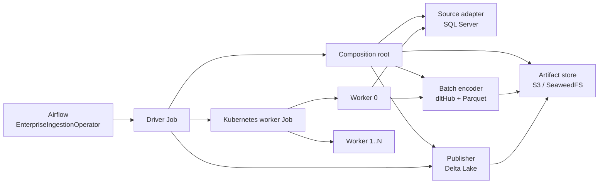
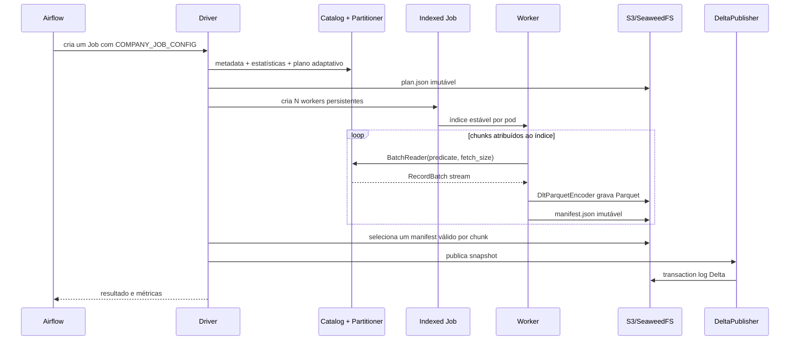

# Decisão: motor de ingestão composável

**Status:** aceita e implementada
**Versão inicial:** `company-dlt-ingestion 0.6.0`

## Contexto

O primeiro MVP implementou SQL Server → dltHub/Parquet → S3/SeaweedFS → Delta
Lake dentro de um único runtime distribuído. O fluxo funcionou e permitiu medir
o custo de leitura, conversão e publicação, mas o arquivo principal passou a
conhecer SQL Server, dltHub, S3, Delta e Kubernetes ao mesmo tempo. Incluir uma
origem ou uma forma de publicação exigiria alterar o fluxo inteiro.

O motor precisa continuar executando o cenário atual sem mudar o contrato do
Airflow. Ao mesmo tempo, suas partes precisam evoluir e ser testadas de forma
independente. Nesta etapa não serão adicionadas novas origens nem novos destinos.

## Decisão

O motor usa portas e adaptadores, estratégias selecionadas por um registro
explícito e um único ponto de composição. O Driver Job continua sendo a unidade
isolada de coordenação de uma execução.



As responsabilidades são:

| Componente | Responsabilidade atual | Não conhece |
|---|---|---|
| `Catalog` | Lê metadados e estatísticas da tabela | dltHub, S3, Delta, Kubernetes |
| `Partitioner` | Calcula chunks, ranges, concorrência e `fetch_size` | Codificação e publicação |
| `BatchReader` | Executa um predicado e entrega lotes | Destino e coordenação |
| `BatchEncoder` | Converte lotes em artefatos Parquet | Planejamento e Kubernetes |
| `ArtifactStore` | Persiste dados, planos e manifests | Semântica da origem |
| `Publisher` | Valida os artefatos e cria a tabela Delta | Como os workers foram criados |
| aplicação | Ordena planejamento, workers, validação e publicação | Detalhes internos dos adapters |
| infraestrutura | Integra Kubernetes e observabilidade | Regras de leitura e de publicação |

O contrato preferencial entre leitura e codificação é um fluxo de
`pyarrow.RecordBatch`. O backend `sqlalchemy_rows` permanece como caminho de
compatibilidade e diagnóstico; ele materializa listas de dicionários e respeita
a mesma porta `BatchReader`. Entre pods, o contrato continua sendo o plano e os
manifests JSON imutáveis no object store. Assim, nenhum objeto Python precisa
ser compartilhado entre processos.

## Composição atual

O arquivo
`engines/dlt/src/company_dlt_ingestion/bootstrap/composition.py` é o único
composition root. Ele resolve uma configuração em quatro componentes:

```text
source.type=sqlserver              -> SqlServerSourceAdapter
execution.encoder=dlt_parquet      -> DltParquetEncoder
storage.type=s3                    -> S3ObjectStore
destination.format=delta           -> DeltaPublisher
```

`execution.encoder` e `storage.type` são opcionais e assumem os valores acima.
Isso mantém compatibilidade com todas as DAGs existentes. O registro é explícito
em `bootstrap/registry.py`; a instalação do wheel não executa descoberta dinâmica
nem importa plugins externos.

## Fluxo da execução



O driver mantém idempotência por `run_id`: reutiliza plano, checkpoints e
resultado quando o conteúdo imutável é compatível. Cada worker processa vários
chunks em sequência, por isso `parallelism=4` significa quatro pods persistentes
mesmo que o plano contenha dezenas de chunks.

## Como adicionar uma implementação no futuro

Uma nova origem deve implementar um adapter que forneça `partitioner()` e
`reader(backend)`. O adapter registra uma chave nova em `COMPONENTS.sources`.
Uma nova forma de gerar arquivos implementa `BatchEncoder`; um novo object store
implementa `ArtifactStore`; e um novo formato de tabela implementa `Publisher`.
O fluxo do driver e o operador Airflow não devem receber condições específicas
da tecnologia.

Antes de registrar uma implementação, seus testes devem provar:

1. cobertura completa e sem sobreposição dos chunks;
2. fechamento de conexões em sucesso e falha;
3. manifests determinísticos e retomada por `run_id`;
4. contagem de registros antes da publicação;
5. métricas com as mesmas unidades do contrato atual.

## Consequências

O cenário atual ganhou mais módulos, mas cada mudança fica confinada à sua
responsabilidade. O registro explícito reduz comportamento implícito durante o
MVP e torna as combinações aceitas visíveis em revisão de código. A imagem ainda
contém todas as dependências do motor atual; separar dependências por plugin só
passa a ter benefício quando existirem outras implementações de fato.

O pacote Python do motor dlt é `company_dlt_ingestion`, enquanto o job Spark
usa `company_ingestion`. Essa separação impede que as duas engines ocupem o
mesmo namespace quando os testes ou ferramentas carregam ambas. A interface
externa do motor dlt continua sendo a imagem, `COMPANY_JOB_CONFIG` e os papéis
`driver`/`worker`; o Airflow não importa módulos internos da engine.

## Validação do refactor

O aceite da versão `0.6.0` executou a DAG
`company_ingestion_dlt_distributed` de ponta a ponta no Minikube com o perfil
`small` e a tabela `Benchmark.dbo.wide`:

| Evidência | Resultado |
|---|---:|
| Testes automatizados | 44 aprovados |
| Registros e colunas | 1.000.000 × 48 |
| Workers persistentes | 4 |
| Chunks/arquivos | 8 / 8 |
| Componentes | `sqlserver → mssql_arrow → dlt_parquet → s3 → delta` |
| Publicação | `zero_copy`, Delta versão 0 |
| Amplificação lógica | 1,0 |
| Tempo do motor | 16,97 s |
| Throughput observado | 63.809 registros/s |

O run dlt `enterprise-ingest-table-8197e563bb92c480` terminou com sucesso no
Airflow e no Kubernetes usando a imagem refatorada. Como regressão cruzada, a
DAG Spark também ingeriu a tabela `small`: 10.000 registros, um arquivo Delta,
213.874 bytes e resultado confirmado pelo readback. Os números são evidência
funcional deste laboratório; não substituem uma série de benchmark controlada.
