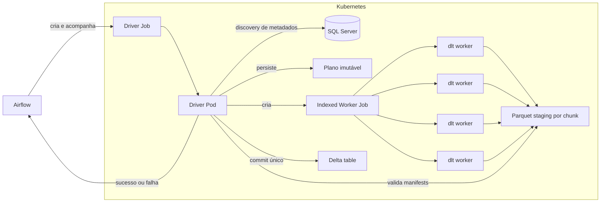
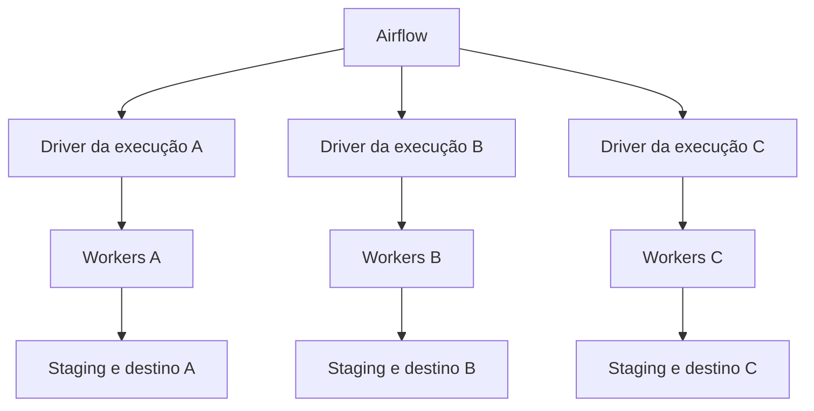
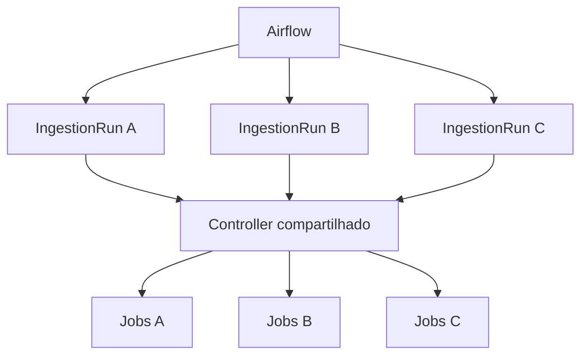
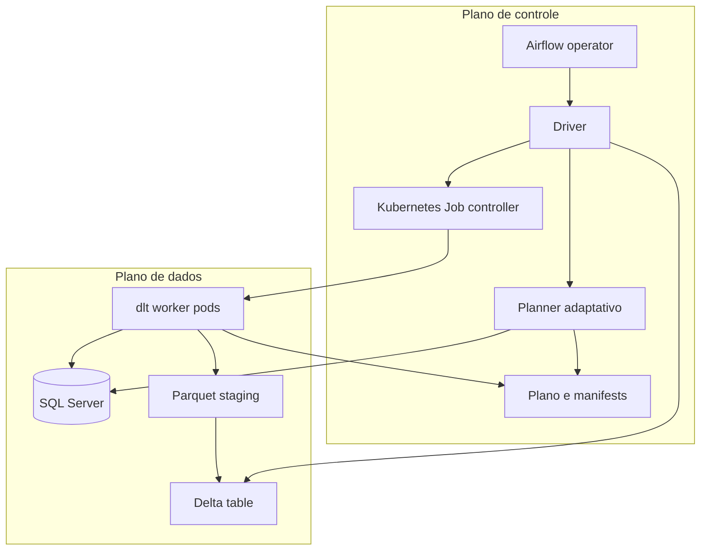
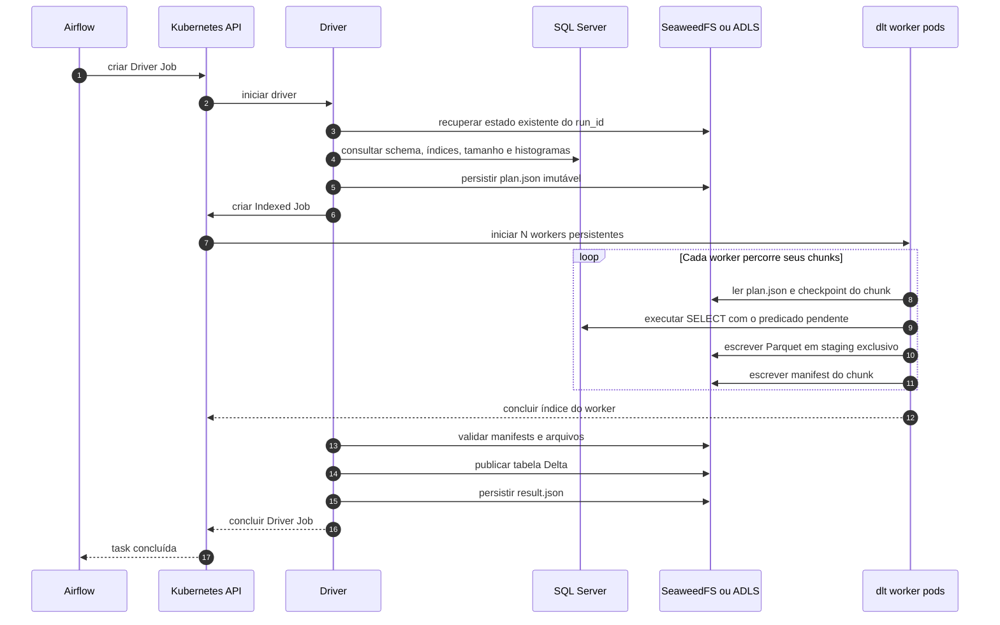
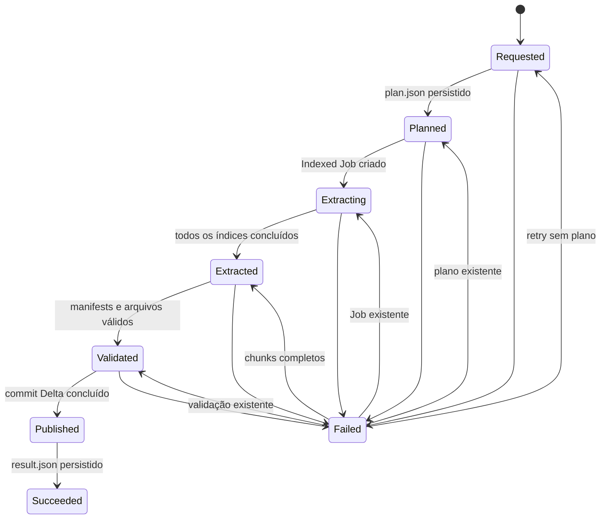
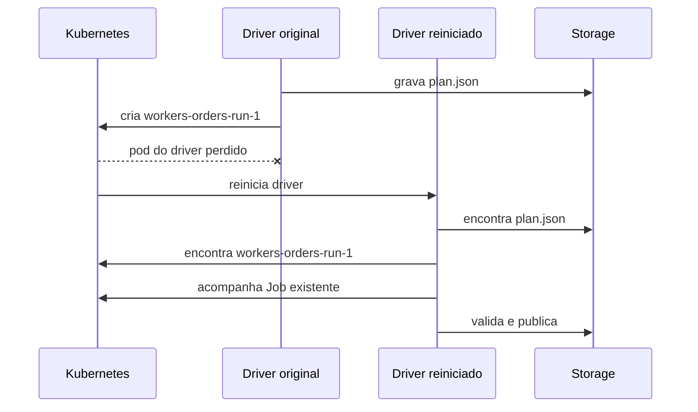
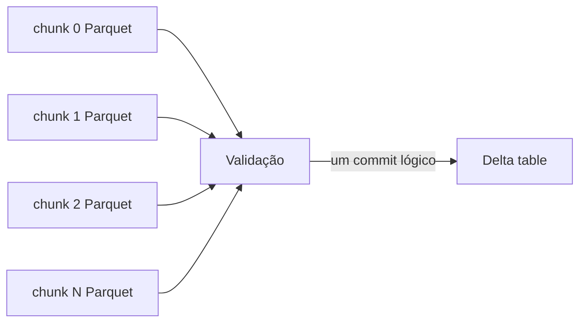

# Ingestão dltHub distribuída com Driver Job

Status: **implementada e validada no laboratório local**.

Este documento define a evolução do caminho dltHub para distribuir a leitura de
uma tabela entre vários pods. O objetivo é preservar uma única chamada no
Airflow e isolar cada execução em seu próprio coordenador temporário, sem criar
um serviço central responsável por todas as ingestões.

## Decisão

Cada execução terá seu próprio **Driver Job**. O driver consulta a origem,
produz um plano imutável, cria um Kubernetes Indexed Job para executar os
chunks com dltHub, acompanha os resultados e publica a tabela Delta.

Para quem escreve a DAG, todo o ciclo continua sendo uma única task:

```text
Airflow -> EnterpriseIngestionOperator -> Driver Job -> resultado
```

O Airflow não recebe o plano, não cria os workers e não conhece os predicados
SQL. Essas responsabilidades permanecem dentro da execução no Kubernetes.

O benchmark original de um único pod continua disponível por meio do
`EnterpriseK8sOperator`. A execução distribuída é exposta separadamente pelo
`EnterpriseIngestionOperator` e pela DAG `company_ingestion_dlt_distributed`.

## Visão geral



O driver é criado para uma execução específica e termina junto com ela. Duas
ingestões simultâneas não compartilham coordenador nem estado mutável:



Essa segregação limita o impacto de falhas: a queda ou o cancelamento do driver
A não altera o ciclo de controle das execuções B e C.

O **Kubernetes Job controller** citado neste documento é o controlador nativo do
Kubernetes, já existente no cluster. Ele apenas mantém pods e conclusões de um
Job. Não será criado um Company Ingestion Controller central.

## Alternativa não adotada: Kubernetes Operator próprio

A alternativa avaliada manteria um controller da aplicação permanentemente no
cluster. O Airflow criaria recursos `IngestionRun`, e esse único serviço
reconciliaria todas as ingestões:



Essa opção concentra no controller o acompanhamento de todas as execuções,
controle de concorrência, versionamento do CRD, recuperação, upgrades e
isolamento entre usuários. O volume de reconciliações e objetos cresce com toda
a plataforma.

O Driver Job foi escolhido porque mantém o ciclo de controle dentro da execução
que o originou:

| Questão | Driver Job escolhido | Operator próprio não adotado |
|---|---|---|
| Coordenador | Um por execução | Um serviço compartilhado |
| Tempo de vida | Duração do run | Permanente |
| Impacto de falha | Run específico | Pode afetar vários runs |
| Estado tratado | Uma ingestão | Todas as ingestões ativas |
| Implantação | Imagem e RBAC de Job | Controller, CRD, RBAC e estratégia de upgrade |
| Limites globais | Airflow Pool e quotas nativas | Também exigiriam políticas no controller |

Essa escolha não elimina todos os recursos compartilhados: Kubernetes, storage,
Prometheus e o banco de origem continuam comuns. Ela evita colocar o estado e a
lógica de coordenação de todas as ingestões dentro de um serviço de aplicação.

## Plano de controle e plano de dados



O plano de controle decide e acompanha. O plano de dados movimenta os registros.
O Airflow fica fora das decisões específicas de SQL Server e dltHub.

### Caminho colunar no plano de dados

O SQLAlchemy continua no plano de controle porque facilita consultas portáveis
ao catálogo, parâmetros e metadados. O volume da tabela não passa por ele. Por
padrão, cada worker usa `mssql-python` e o ODBC Driver para receber os resultados
diretamente como lotes Arrow:

```text
SQL Server
  -> ODBC Driver / mssql-python (C++)
  -> Arrow RecordBatch
  -> rota Arrow do dltHub
  -> Parquet
  -> SeaweedFS
  -> commit Delta sem cópia
```

Esse caminho não cria `SQLAlchemy Row`, `dict` ou listas de registros. Como a
origem é relacional e plana, o schema Arrow já descreve nomes, nulabilidade e
tipos; o normalizador linha a linha do dltHub não é necessário. Arrow é o
formato colunar em memória e Parquet é a representação colunar persistida. A
passagem Arrow para Parquet permite que o writer trabalhe com buffers colunares
sem reconstruir objetos Python por registro.

`execution.extract_backend=sqlalchemy_rows` mantém o caminho legado para
compatibilidade e diagnóstico. Nesse modo, o dltHub infere e evolui o schema,
normaliza nomes e estruturas, converte tipos e adiciona colunas internas a
partir de dicionários Python; essa flexibilidade custa CPU e alocações.

## Responsabilidades

| Componente | Responsabilidade |
|---|---|
| DAG | Declarar origem, tabela, destino e limites operacionais. |
| `EnterpriseIngestionOperator` | Criar ou reanexar ao Driver Job, acompanhar seu estado e retornar o resultado. |
| Driver | Manter a máquina de estados de uma execução e criar os recursos filhos. |
| Planner adaptativo | Consultar metadados e estatísticas, selecionar a estratégia e produzir chunks. |
| Kubernetes Job controller | Manter exatamente o conjunto planejado de workers e repetir o índice de um worker que falhar. |
| dlt worker | Permanecer ativo, processar sua lista de chunks em sequência e produzir um manifesto imutável por chunk. |
| Validador | Confirmar cobertura, schema, contagens, bytes e ausência de chunks duplicados. |
| Publisher | Tornar a carga visível como uma tabela Delta por meio de um único escritor. |
| Storage | Persistir plano, dados temporários, manifests, resultado e tabela Delta. |

O wheel do motor contém planner, adaptadores de origem, worker, validação e
publicação. O operador Airflow não replica essa lógica.

## Uma imagem com papéis distintos

A mesma imagem versionada pode executar todos os papéis:

```text
company-dlt-ingestion:0.6.0
  /app/main.py driver
  /app/main.py worker
```

O isolamento de responsabilidades acontece no comando e no processo executado,
sem exigir uma imagem diferente para cada fase. Driver e workers usam exatamente
a mesma versão do wheel e do contrato do plano. Validação e publicação são fases
internas do driver após a conclusão dos workers.

Estrutura implementada no wheel:

```text
company_dlt_ingestion/
├── application/          # driver, worker, configuração, plano e estado
├── bootstrap/            # entrypoint, registry e composition root
├── core/                 # contratos e serialização determinística
├── infrastructure/       # cliente Kubernetes e métricas
└── plugins/
    ├── sources/          # adapter SQL Server e leitores Arrow/rows
    ├── encoders/         # dltHub → Parquet
    ├── stores/           # S3 compatível
    └── publishers/       # commit e validação Delta

company_ingestion_core/   # modelos e planner adaptativo compartilhado
```

## Fluxo da execução



O driver permanece pequeno enquanto aguarda os workers. Ele não transporta
dados da tabela e não executa transformações em memória.

## Planejamento adaptativo

O planner roda dentro do Driver Job antes da criação dos workers. Para SQL
Server, ele consulta:

- schema e tipos das colunas;
- chave primária e índices utilizáveis;
- quantidade estimada de linhas e páginas;
- estatísticas e histogramas;
- cardinalidade das colunas candidatas;
- valores mínimos e máximos quando necessários;
- limites de conexão e paralelismo definidos para a origem.

Ele seleciona `histogram_ranges`, `indexed_ranges` ou `single_scan`. A ausência
de uma chave segura resulta em uma leitura única; o planner não inventa uma
divisão que possa duplicar ou omitir registros.

Exemplo resumido de plano:

```json
{
  "version": 1,
  "run_id": "orders-20260922-001",
  "source": {
    "type": "sqlserver",
    "schema": "dbo",
    "table": "orders"
  },
  "strategy": "histogram_ranges",
  "column": "order_id",
  "estimated_rows": 300000000,
  "estimated_source_bytes": 193273528320,
  "chunk_count": 64,
  "parallelism": 4,
  "chunks": [
    {
      "index": 0,
      "predicate": "[order_id] < 6389212"
    },
    {
      "index": 1,
      "predicate": "[order_id] >= 6389212 AND [order_id] < 11938442"
    }
  ]
}
```

O plano é imutável depois de publicado. Um retry reutiliza o mesmo plano; uma
mudança de estratégia exige um novo `run_id`.

## Distribuição por Indexed Job

O número de chunks é diferente do número de workers. Uma execução pode ter 63
chunks e quatro pods persistentes. O Indexed Job possui quatro completions, uma
por worker, e cada processo executa vários chunks antes de terminar:

```text
completions: 4
parallelism: 4

worker 0: [00] [04] [08] [12] ... [60]
worker 1: [01] [05] [09] [13] ... [61]
worker 2: [02] [06] [10] [14] ... [62]
worker 3: [03] [07] [11] [15] ... [59]
```

O pod lê `JOB_COMPLETION_INDEX` como índice do worker. A atribuição é
`chunk.index % parallelism == worker.index`. Como os histogramas procuram gerar
ranges com cardinalidades semelhantes, a atribuição estática distribui a carga
sem exigir uma fila externa. O worker verifica o manifesto antes de cada chunk;
em um retry, ignora os chunks já concluídos e continua nos pendentes.

Os 63 chunks da validação histórica foram provocados por um override de 8 MiB:
`ceil(520.921.088 / 8.388.608) = 63`. Esse cenário exercitava checkpoints e
reutilização de pods. O contrato atual usa `target_chunk_bytes=auto`; para a
mesma tabela, quatro workers e o limite de 64 chunks, o plano resolve oito
chunks de aproximadamente 62 MiB.

Manifesto conceitual:

```yaml
apiVersion: batch/v1
kind: Job
metadata:
  name: workers-orders-20260922-001
  labels:
    company.io/run-id: orders-20260922-001
    company.io/role: dlt-worker
spec:
  completionMode: Indexed
  completions: 4
  parallelism: 4
  backoffLimitPerIndex: 3
  template:
    metadata:
      labels:
        company.io/run-id: orders-20260922-001
        company.io/role: dlt-worker
    spec:
      serviceAccountName: ingestion-worker
      restartPolicy: Never
      containers:
        - name: worker
          image: company-dlt-ingestion:0.6.0
          args: ["worker"]
          env:
            - name: COMPANY_JOB_CONFIG
              value: '{...}'
            - name: POD_UID
              valueFrom:
                fieldRef:
                  fieldPath: metadata.uid
```

Essa configuração cria quatro pods para os 63 chunks. Uma fila dinâmica poderá
ser avaliada se os histogramas não forem suficientes para equilibrar tabelas
com chunks muito diferentes, mas não é necessária no MVP.

## Persistência de estado

O estado durável é armazenado no object storage e no próprio estado dos Jobs do
Kubernetes:

```text
s3://ingestion-control/runs/<run_id>/
├── request.json
├── plan.json
├── state/
│   ├── selected-chunks.json
│   └── failed.json
├── chunks/
│   ├── 00000/
│   │   ├── attempts/
│   │   │   ├── <pod-uid-1>/
│   │   │   │   └── manifest.json
│   │   │   └── <pod-uid-2>/
│   │   │       └── ...
│   └── 00001/
│       └── ...
└── result.json
```

Os Parquets ficam em `<destination>/<run_id>/_staging/chunks/...`. O Minikube
usa SeaweedFS. No AKS, o contrato manterá os mesmos objetos em ADLS Gen2 após a
inclusão do adaptador Azure. A coordenação usa objetos imutáveis, hashes de
conteúdo e nomes determinísticos, sem filesystem local compartilhado.

## Máquina de estados do driver



Cada transição só é registrada depois que seu efeito durável estiver concluído.
O estado nunca deve indicar `Published` antes de o commit Delta estar visível.

## Idempotência

O mesmo `run_id` representa a mesma intenção e o mesmo snapshot. O driver pode
ser iniciado novamente sem duplicar dados ou criar um segundo conjunto lógico
de workers.

Regras obrigatórias:

1. `request.json` recebe um hash da configuração canônica. O mesmo `run_id` com
   outro hash é rejeitado.
2. `plan.json` é criado uma única vez e não é recalculado em retries.
3. Recursos Kubernetes usam nomes derivados de `run_id` e são recuperados antes
   de qualquer tentativa de criação.
4. Cada tentativa escreve em um prefixo contendo `chunk_id` e o UID do pod,
   recebido pela Downward API. Duas tentativas nunca escrevem o mesmo objeto.
5. Cada worker verifica os manifests antes de ler um chunk. Um retry do mesmo
   índice de worker reaproveita tudo que já foi concluído.
6. Depois do Indexed Job terminar, o driver encontra os manifests por
   `chunk_id`, valida seus arquivos e grava `selected-chunks.json`. Se existirem
   tentativas duplicadas, escolhe uma de forma determinística.
7. A publicação usa identificador transacional derivado de `run_id`.
8. `result.json` é o marcador terminal e pode ser lido novamente pelo operador.
9. Cancelamento e retry não removem dados necessários para recuperação.
10. Limpeza de staging ocorre somente depois da retenção configurada.

Exemplo de retomada:



## Escrita e publicação Delta

Os workers não executam `replace` nem criam simultaneamente o transaction log
da tabela final. Cada worker escreve Parquet em seu próprio prefixo de staging.
Depois que todos os chunks terminam, o driver inicia uma publicação com um único
escritor.



Essa decisão:

- evita conflito entre escritores Delta;
- mantém um único ponto de publicação, inclusive quando o adaptador ADLS Gen2
  for incluído;
- impede que consumidores vejam uma carga parcial;
- permite descartar uma tentativa defeituosa sem alterar a tabela publicada.

O staging padrão fica dentro da raiz da tabela Delta. Quando os schemas Parquet
são compatíveis, o publisher cria uma única transação com `AddAction` para os
arquivos selecionados. Os bytes não atravessam novamente o cliente e não são
reescritos no object storage. Se houver tipos físicos incompatíveis ou staging
externo, o modo `auto` faz fallback para normalização e reescrita. O resultado e
`company_ingestion_plan_info` registram `publication_mode=zero_copy` ou
`publication_mode=rewrite`.

Incrementais futuros poderão extrair chunks em paralelo e manter a etapa de
`append` ou `merge` serializada pelo driver.

## Consistência da origem

Idempotência do coordenador não cria consistência no SQL Server. A implementação
local atual valida tabelas estáveis durante a carga. Para tabelas que mudam
durante o snapshot, a promoção produtiva deve registrar uma fronteira estável:

- LSN inicial quando SQL Server CDC estiver habilitado;
- snapshot isolation aprovado pela administração do banco; ou
- watermark confiável para fontes que só recebem inserts.

O modo escolhido e sua fronteira deverão fazer parte de `plan.json`. Após o
snapshot, um processo incremental poderá aplicar as mudanças posteriores à
fronteira. CDC, snapshot isolation e incrementais não fazem parte deste MVP.

## Segregação e RBAC

O driver e os workers usam ServiceAccounts diferentes.

| Papel | Permissões Kubernetes |
|---|---|
| Airflow | Criar, consultar e acompanhar somente Driver Jobs. |
| Driver | Criar, consultar e acompanhar Jobs filhos; consultar pods e eventos. |
| Worker | Nenhuma permissão para criar workloads; apenas leitura de configuração e Secrets montados. |

No storage:

| Papel | Permissões de dados |
|---|---|
| Planner/driver | Ler e gravar o prefixo de controle do próprio `run_id`. |
| Worker | Ler `plan.json` e escrever somente seu prefixo de chunk. |
| Publisher | Ler staging e gravar o destino Delta autorizado. |

Credenciais são fornecidas por referências a Kubernetes Secrets. Senhas nunca
são gravadas em `request.json`, `plan.json`, argumentos de processo ou labels.

## Observabilidade

Todas as métricas carregam `run_id`, `source`, `table`, `engine` e `profile`.
Métricas de worker também carregam `chunk_id` e `attempt`.

Métricas mínimas:

```text
company_ingestion_phase_duration_seconds
company_ingestion_source_rows_total
company_ingestion_source_bytes_total
company_ingestion_output_bytes_total
company_ingestion_chunks_total
company_ingestion_chunks_running
company_ingestion_chunks_succeeded
company_ingestion_chunks_failed
company_ingestion_chunk_duration_seconds
company_ingestion_chunk_rows_total
company_ingestion_chunk_bytes_total
company_ingestion_chunk_phase_duration_seconds
company_ingestion_chunk_cpu_seconds
company_ingestion_source_connections
company_ingestion_throughput_rows_per_second
company_ingestion_throughput_bytes_per_second
company_ingestion_retries_total
company_ingestion_target_chunk_bytes
company_ingestion_fetch_size
company_ingestion_staging_data_bytes
company_ingestion_publication_data_bytes_written
company_ingestion_data_write_amplification_ratio
```

O resultado final agrega:

- duração de planejamento, extração, validação e publicação;
- throughput global e por chunk;
- distribuição e skew da duração dos chunks;
- linhas e bytes estimados e realizados;
- quantidade de arquivos;
- tamanho de chunk e fetch resolvidos pelo planner;
- bytes de staging, bytes reescritos e amplificação lógica de escrita;
- tentativas e falhas;
- estratégia, coluna de divisão e paralelismo escolhidos.

O Airflow mostra o estado agregado do Driver Job. Kubernetes Dashboard e logs
mostram os pods individuais. Prometheus e Grafana mostram progresso, throughput,
skew e consumo de recursos.

## Contrato pretendido no Airflow

```python
EnterpriseIngestionOperator(
    task_id="ingest_orders",
    image="company-dlt-ingestion:0.6.0",
    runtime="dlt",
    source={
        "type": "sqlserver",
        "host": "sqlserver",
        "port": 1433,
        "database": "Sales",
        "schema": "dbo",
        "table": "orders",
        "credentials_secret": "sqlserver-credentials",
    },
    destination={
        "format": "delta",
        "uri": "s3://lakehouse/dlt/bronze/orders",
    },
    execution={
        "workers": "adaptive",
        "max_workers": 4,
        "target_chunk_bytes": "auto",
        "fetch_size": "auto",
        "max_source_connections": 4,
    },
    metrics={
        "output_uri": "s3://metrics/distributed-dlt",
        "pushgateway": "http://pushgateway:9091",
    },
)
```

`max_workers` e `max_source_connections` são limites de proteção. O planner pode
escolher números menores, mas nunca maiores. Coluna de divisão, predicados,
quantidade de chunks e paralelismo efetivo não fazem parte da interface pública.

## Falhas e comportamento esperado

| Falha | Comportamento |
|---|---|
| Planner falha antes de persistir o plano | Retry refaz discovery. |
| Planner falha depois de persistir o plano | Retry reutiliza `plan.json`. |
| Worker falha antes de escrever | Kubernetes repete o índice do worker; o novo pod ignora checkpoints existentes. |
| Worker falha durante a escrita | Nova tentativa usa outro prefixo e retoma no primeiro chunk sem manifest válido. |
| Worker termina e driver reinicia | Driver encontra o Job e os manifests existentes. |
| Um worker esgota seus retries | Worker Job falha; publicação não acontece. |
| Validação falha | Staging é preservado para diagnóstico; tabela final não muda. |
| Publicação falha antes do commit | Retry repete a publicação. |
| Publicação conclui e driver cai | O identificador transacional impede nova publicação lógica. |
| Airflow reinicia | O operador se reanexa ao Driver Job pelo nome determinístico. |

## Limites da decisão

O Driver Job não pretende substituir o scheduler distribuído do Spark. Ele é
adequado a leituras independentes por predicado e escritas append-only em
staging. Não oferecerá shuffle distribuído, joins entre workers, cache ou
recomputação por lineage.

O paralelismo também continua limitado pela capacidade do SQL Server. Criar mais
pods que o banco consegue atender reduz a estabilidade sem aumentar throughput.

A segregação por Driver Job não elimina a necessidade de limites globais. O
Airflow Pool limita quantas ingestões podem começar simultaneamente; Kubernetes
`ResourceQuota` e `LimitRange` limitam CPU, memória e quantidade de pods no
namespace. Esses mecanismos protegem o cluster sem fazer um serviço de aplicação
coordenar o estado de todas as ingestões.

## Implementação entregue

- Planner puro compartilhado pelos caminhos Spark e dlt distribuído.
- Adaptador SQLAlchemy/pymssql restrito ao discovery e planejamento do SQL Server.
- Data plane colunar com `mssql-python`: o ODBC Driver entrega `RecordBatch`
  Arrow diretamente ao dltHub, sem `SQLAlchemy Row`, `dict` ou lista de linhas.
- Comandos `driver` e `worker` na imagem `company-dlt-ingestion:0.6.0`.
- `request.json`, `plan.json`, manifests por pod UID e `result.json` duráveis.
- `EnterpriseIngestionOperator` no provider Airflow.
- ServiceAccounts e RBAC separados para driver e workers.
- Indexed Job com `completions == parallelism`, pods persistentes e vários chunks
  por worker.
- Validação de todos os manifests e publicação Delta por escritor único.
- Métricas de progresso durante a execução e métricas finais no Grafana.
- DAG local `company_ingestion_dlt_distributed`.

A validação no AKS/ADLS continua como etapa de promoção do ambiente. O contrato
da DAG separa storage da lógica do planner e dos workers, mas o adaptador deste
MVP implementa somente S3 compatível/SeaweedFS. ADLS Gen2 exige um adaptador de
object store e opções de credencial do `delta-rs`.

## Critérios de aceite

- A DAG contém uma única task de ingestão.
- O Airflow cria apenas o Driver Job e acompanha seu resultado.
- O planner seleciona automaticamente estratégia, coluna, chunks e workers.
- Uma tabela é lida por mais de um pod dlt quando o plano recomendar.
- Nenhum worker pode ler fora do predicado atribuído.
- Um retry de chunk não duplica dados publicados.
- Reiniciar o driver não cria outro plano nem outro Job lógico.
- Uma falha parcial não altera a tabela Delta final.
- O resultado agrega contagem, bytes, throughput, tempos, chunks e tentativas.
- A interface da DAG permanece estável na troca de Minikube/SeaweedFS por
  AKS/ADLS Gen2; o adaptador Azure será validado na promoção.

## Evidência da validação local

Em 22 de setembro de 2026, os três perfis foram disparados pela DAG no Airflow
local com a versão `0.3.0`:

| Tabela | Linhas | Chunks | Pods workers | Saída Delta | Throughput | Retries | Extração | Publicação | Total do motor |
|---|---:|---:|---:|---:|---:|---:|---:|---:|---:|
| `small` | 10.000 | 1 | 1 | 0,45 MB | 1.018 linhas/s | 0 | 9,83 s | 1,54 s | 12,21 s |
| `medium` | 200.000 | 9 | 2 | 20,8 MB | 9.302 linhas/s | 0 | 21,50 s | 1,85 s | 23,83 s |
| `wide` | 1.000.000 | 63 | 4 | 191,8 MB | 16.484 linhas/s | 0 | 60,67 s | 8,54 s | 70,16 s |

No `medium`, dois UIDs de pod produziram os nove manifests. No `wide`, quatro
UIDs produziram os 63 manifests, confirmando que nenhum pod novo foi criado por
chunk. O driver continuou no perfil `small`; somente o worker do cenário
`small`, solicitado como `medium`, recebeu 4 CPUs/6 GiB.

### Limites atuais do MVP

- A origem precisa permanecer estável durante uma carga full; CDC e fronteira
  transacional ainda serão implementados para fontes mutáveis.
- A publicação sem cópia aceita schemas físicos compatíveis. Incompatibilidades
  acionam a normalização com reescrita e ficam identificadas nas métricas.
- Uma tabela completamente vazia ainda não é publicada porque não existe um
  schema Parquet para inicializar o Delta.
- O adaptador de object storage atual aceita endpoints S3 compatíveis. ADLS Gen2
  requer o adaptador Azure mencionado acima.

## Referências

- [Kubernetes: Indexed Job para processamento paralelo](https://kubernetes.io/docs/tasks/job/indexed-parallel-processing-static/)
- [Kubernetes: Jobs](https://kubernetes.io/docs/concepts/workloads/controllers/job/)
- [dltHub: divisão de cargas SQL grandes](https://dlthub.com/docs/dlt-ecosystem/verified-sources/sql_database/advanced)
- [Delta Lake: controle de concorrência](https://docs.delta.io/concurrency-control/)
- [Contrato atual do laboratório](../reference/configuration.md)
- [Comparação Spark × dltHub](../benchmarks/spark-dlt-comparison.md)
