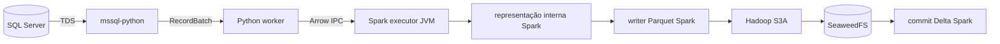
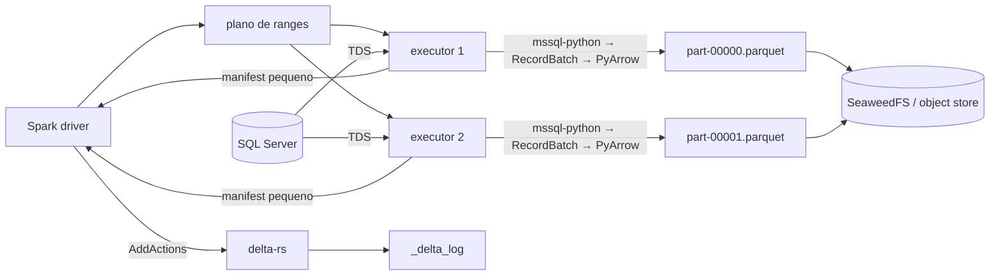
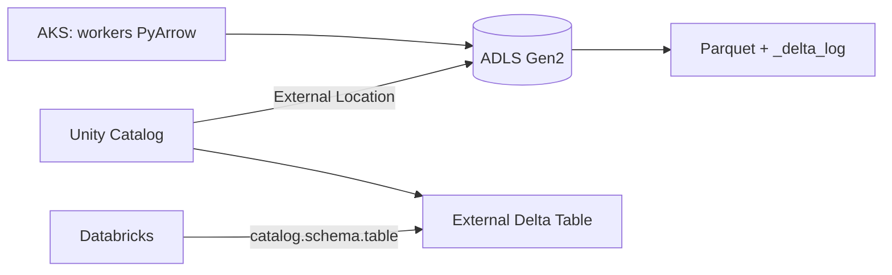

# SQL Server → PyArrow → Delta Lake por manifesto

## Propósito e decisão

Este documento descreve o caminho colunar de ingestão que lê SQL Server com
`mssql-python`, produz Parquet diretamente com PyArrow e publica a tabela com
`delta-rs`. Ele registra a comparação controlada com o writer Delta do Spark,
explica onde surgiu o ganho de desempenho e delimita como o resultado pode ser
usado posteriormente no Azure Databricks e no Unity Catalog.

A decisão atual é:

- usar o caminho PyArrow + `delta-rs` para cópia de origem para landing sem
  transformação distribuída relevante;
- preservar o writer Delta do Spark para workloads que precisem de joins,
  agregações, shuffles, deduplicação, `MERGE` ou outras transformações Spark;
- tratar uma tabela Delta publicada fora do Databricks inicialmente como
  **External Delta Table** no Unity Catalog;
- não escrever por caminho físico em uma tabela Unity Catalog Managed. Esse
  caso exige Unity REST API e catalog commits, ainda não implementados neste
  motor.

O benchmark mostra um ganho de 4,12 vezes no tempo entre o início da leitura e
o commit Delta. O ganho veio principalmente da remoção do data plane Spark
depois da leitura Arrow, não de uma leitura quatro vezes mais rápida do banco.

## Escopo implementado

O código atual está dividido entre:

- [`mssql_arrow.py`](../../engines/spark/job/src/company_ingestion/sources/mssql_arrow.py):
  conexão, leitura Arrow, prefetch e métricas das tasks;
- [`sqlserver.py`](../../engines/spark/job/src/company_ingestion/sources/sqlserver.py):
  discovery, plano adaptativo e distribuição dos ranges;
- [`pyarrow_parquet.py`](../../engines/spark/job/src/company_ingestion/writers/pyarrow_parquet.py):
  Parquet, upload, manifests e commit Delta;
- [`engine.py`](../../engines/spark/job/src/company_ingestion/engine.py): seleção
  do writer, validação e resultado durável;
- [`run-spark-reader-benchmark.py`](../../tools/run-spark-reader-benchmark.py):
  execução reproduzível no laboratório.

O writer direto atual aceita URIs `s3://`/`s3a://` e foi validado contra o
SeaweedFS. ADLS Gen2 e autenticação Azure são uma evolução necessária antes do
uso produtivo no Azure.

## Fluxo comum: discovery e planejamento

Os dois writers comparados usam exatamente o mesmo começo de pipeline. O motor:

1. lê metadados e histograma da tabela no SQL Server;
2. estima linhas, bytes e largura média;
3. escolhe uma coluna de range apropriada;
4. limita o paralelismo pelos recursos e conexões disponíveis;
5. calcula o `fetch_size` para aproximar o batch Arrow alvo;
6. cria predicates não sobrepostos;
7. entrega cada range a uma task Spark.

No teste controlado, o plano resultante foi:

```json
{
  "strategy": "histogram_ranges",
  "column": "id",
  "predicates": ["[id] < 500001", "[id] >= 500001"],
  "partitions": 2,
  "estimated_rows": 1000000,
  "estimated_source_bytes": 520921088,
  "fetch_size": 32201,
  "target_fetch_batch_bytes": 16777216
}
```

Cada task abriu uma conexão independente e leu 500.000 linhas. Isso preserva o
paralelismo distribuído: Spark ainda agenda driver e executores, mas o writer
PyArrow não entrega o conteúdo da tabela ao mecanismo relacional do Spark.

## Leitura colunar com `mssql-python`

Cada executor cria a conexão e chama a API Arrow do cursor:

```python
connection = mssql_python.connect(connection_string)
cursor = connection.cursor()
cursor.execute(query)
reader = cursor.arrow_reader(batch_size=batch_size)

for batch in reader:
    consume(batch)
```

O resultado é um `pyarrow.RecordBatch`. Os valores são organizados em buffers
por coluna, acompanhados de schema, offsets e bitmaps de nulidade. O caminho
quente não materializa uma `SQLAlchemy Row`, um `dict` ou uma coleção de objetos
Python para cada registro.

```text
Caminho orientado a linhas

TDS → Row/tupla → objetos Python → dict → lista de dicts → Arrow/Parquet

Caminho colunar utilizado

TDS → mssql-python Arrow reader → Arrow RecordBatch → consumidor colunar
```

Esse desenho reduz alocações, garbage collection e conversões por linha. O
termo `zero-copy` deve ser usado com cuidado: o protocolo TDS ainda precisa ser
decodificado e o Parquet precisa ser codificado e comprimido. A propriedade
relevante é preservar o formato colunar depois da decodificação, com menos
representações intermediárias.

### Prefetch limitado

Uma thread pertencente à conexão produz batches para uma fila de tamanho um. A
task consome o batch anterior enquanto a produtora busca o próximo:

```text
thread SQL:  fetch batch 1 ─ fetch batch 2 ─ fetch batch 3
task:                       consume 1 ───── consume 2 ───── consume 3
```

A fila de uma posição:

- permite sobrepor fetch e consumo;
- limita a memória adicional a um batch por task;
- mantém conexão, cursor e Arrow reader na mesma thread;
- propaga erros e encerramento para o consumidor.

## Caminho 1: `mssql-python` + `mapInArrow` + Spark Delta

No writer Spark, o Python produz batches para `mapInArrow`:



O Arrow reduz o custo da fronteira Python/JVM em relação a objetos Python por
linha, mas não elimina a fronteira. O Spark precisa consumir o stream Arrow,
validar tipos, integrá-lo ao DataFrame e alimentar seu writer Parquet/Delta.

O tempo medido em `arrow_consumer_wait_seconds` começa antes de `yield batch` e
termina quando o Spark solicita o batch seguinte. Portanto ele reúne a pressão
de tudo que está depois do produtor: transporte Arrow, consumo pela JVM,
codificação Parquet, writer Delta e backpressure de storage. Ele não deve ser
interpretado como tempo puro de serialização Arrow IPC.

O Spark acrescenta capacidades importantes para transformação distribuída,
mas a operação medida era uma cópia sem transformação. Nesse caso, o motor
pagava pelo data plane do Spark sem usar joins, agregações ou shuffles.

## Caminho 2: `mssql-python` + PyArrow + `delta-rs`

No writer direto, o mesmo `RecordBatch` é entregue ao `ParquetWriter` no
executor Python:



Cada task:

1. abre sua conexão com o SQL Server;
2. busca batches com prefetch limitado;
3. entrega os batches diretamente ao `pyarrow.parquet.ParquetWriter`;
4. fecha e mede o arquivo local;
5. envia o objeto imutável ao storage;
6. retorna ao driver apenas um manifesto com URI, linhas, bytes, tentativa e
   durações.

Os dados não retornam ao driver e não atravessam a JVM para serem materializados
como DataFrame. Somente os manifests são coletados.

### Publicação por manifesto

O `delta-rs` não codifica os dados Parquet neste fluxo. Os arquivos já foram
produzidos pelo PyArrow. O publisher:

1. lê o schema físico de um arquivo;
2. cria um schema lógico Delta compatível;
3. converte cada manifesto em uma `AddAction`;
4. registra caminho relativo, tamanho, quantidade de registros e timestamp;
5. cria atomicamente a primeira versão de `_delta_log`.

Uma ação é conceitualmente semelhante a:

```json
{
  "add": {
    "path": "part-00000.parquet",
    "size": 49700470,
    "partitionValues": {},
    "dataChange": true,
    "stats": "{\"numRecords\": 500000}"
  }
}
```

O schema lógico é publicado como nullable. Isso evita declarar invariantes
`NOT NULL` sem os table features correspondentes e mantém os tipos físicos dos
Parquets. A escolha é adequada para landing; constraints de domínio devem ser
aplicadas em camadas posteriores.

## Benchmark controlado

### Ambiente e condições

As duas aplicações foram iniciadas do zero com:

| Propriedade | Valor |
|---|---|
| Data do teste | 2026-10-02 |
| Tabela | SQL Server `wide` |
| Linhas | 1.000.000 |
| Colunas | 48 |
| Origem estimada | 520.921.088 bytes |
| Batches Arrow | 32 |
| Arrow em memória | 605.179.328 bytes |
| Partições/tasks | 2 |
| Linhas por range | 500.000 |
| Compressão | Zstandard |
| Memória por executor | 3 GiB heap + 1 GiB overhead |
| Spark | 4.2.0 |
| Delta Spark | 4.4.0 |
| `mssql-python` | 1.15.0 |
| PyArrow | 25.0.1 |
| `deltalake`/delta-rs | 1.6.6 |
| CompanySparkRuntime | 0.4.0 |
| Wheel do motor | 0.10.0 |
| Perfil S3A | default |

Não houve perda de executor, `OOMKilled` ou `FetchFailed`. Ambos os caminhos
foram relidos pelo Spark e retornaram:

```text
rows     = 1.000.000
checksum = 133589279099475762189
```

Isso valida equivalência de linhas e conteúdo para a fixture medida.

### Resultado principal

| Métrica | Spark Delta | PyArrow + delta-rs | Variação |
|---|---:|---:|---:|
| Leitura até commit Delta | 24,39 s | 5,91 s | **-75,8%; 4,12x** |
| Throughput do caminho crítico | 41.001 linhas/s | 169.118 linhas/s | **4,12x** |
| Maior task | 13,49 s | 3,84 s | **-71,6%** |
| Ciclo completo do motor | 62,47 s | 54,50 s | **-12,8%** |
| Arquivos Parquet | 2 | 2 | igual |
| Bytes Parquet | 88.997.201 | 99.481.474 | **+11,8%** |

O caminho direto economizou 18,48 segundos antes do commit. A penalidade foi
10.484.273 bytes adicionais em dois arquivos.

### Decomposição das tasks

| Duração somada das duas tasks | Spark Delta | PyArrow + delta-rs |
|---|---:|---:|
| Conexão | 0,33 s | 0,31 s |
| Execução inicial das queries | <0,01 s | <0,01 s |
| Fetch/decodificação | 7,01 s | 5,62 s |
| Espera do consumidor Arrow | 21,78 s | não aplicável |
| Codificação Parquet | incluída no consumidor | 2,57 s |
| Upload | incluído no writer Spark | 0,36 s |
| Wall time somado | 23,14 s | 6,56 s |
| Span concorrente das tasks | 13,49 s | 3,90 s |

As durações são somas de executores concorrentes. Fetch, prefetch e codificação
também se sobrepõem; por isso, elas explicam a distribuição do trabalho, mas
não devem ser somadas para reconstruir o relógio de parede.

No caminho direto:

```text
extração + Parquet + upload = 5,81 s
commit Delta por manifesto = 0,10 s
tempo até publicação       = 5,91 s
```

O upload somado de 0,36 s deixa claro que o object store não era o gargalo dessa
rodada. Fetch e codificação Parquet concentram o trabalho útil restante.

### Por que o ciclo completo caiu menos

Depois que a tabela PyArrow já estava publicada, o benchmark continuou com:

| Etapa posterior ao commit | PyArrow + delta-rs |
|---|---:|
| `DESCRIBE DETAIL` e `DESCRIBE HISTORY` pelo Spark | 26,39 s |
| Readback integral e checksum | 6,44 s |

Essas duas validações consumiram 32,83 segundos. Por isso o caminho crítico
melhorou 75,8%, enquanto o ciclo completo melhorou apenas 12,8%. O dado estava
duravelmente publicado após 5,91 segundos; o processo permaneceu ativo para
observar e validar o resultado.

Para produção, a política de validação deve ser explícita:

- `strict`: readback integral e checksum, indicado para benchmark e
  homologação;
- `metadata`: valida manifests, contagens, tamanhos e versão Delta;
- `async`: encerra o SLA de publicação no commit e executa verificações pesadas
  fora do caminho crítico.

Esses modos ainda são uma recomendação; o benchmark atual sempre executa a
validação integral.

## De onde veio o ganho

O ganho deve ser atribuído ao conjunto das seguintes mudanças:

1. **Preservação colunar:** `mssql-python` entrega `RecordBatch`; não há
   materialização linha → objeto Python → dicionário.
2. **Remoção da fronteira de dados Python/JVM:** os 605 MB de Arrow em memória
   não precisam alimentar o DataFrame e o writer JVM do Spark.
3. **Menos representações:** PyArrow consome diretamente schema e buffers Arrow
   para construir páginas Parquet.
4. **Menos backpressure:** o produtor deixa de esperar o pipeline Spark Delta;
   a espera observada no caminho Spark foi 21,78 s somados.
5. **Arquivos imutáveis:** cada task finaliza seu próprio arquivo e retorna um
   manifesto pequeno.
6. **Commit de metadados:** `delta-rs` registra os arquivos existentes em
   0,10 s, sem reler ou reescrever um milhão de linhas.

O banco não ficou 4,12 vezes mais rápido: o fetch somado mudou de 7,01 s para
5,62 s, diferença que também contém variação de execução e o efeito de menor
backpressure. A maior economia ocorreu depois que o Arrow chegou ao Python.

Também não se deve concluir que `delta-rs` codifica Parquet quatro vezes mais
rápido que Spark. Neste desenho, PyArrow codifica Parquet e `delta-rs` trabalha
somente no plano de controle da transação.

## Tamanho dos arquivos e próximos ajustes

O resultado PyArrow ficou 11,8% maior mesmo com o mesmo codec Zstandard. Spark e
PyArrow podem usar configurações distintas de:

- tamanho de row group e data page;
- nível de compressão;
- dictionary encoding;
- estatísticas por coluna;
- representação de strings e valores nulos.

Os próximos experimentos devem variar um parâmetro por vez e manter linha,
checksum, número de tasks e recursos constantes. O objetivo é reduzir os bytes
sem devolver ao pipeline os 18,48 segundos eliminados. Upload não é prioridade
no ambiente atual porque representou apenas 0,36 s somados.

## Uso posterior no Azure Databricks

### External Delta Table: caminho recomendado

Uma tabela criada por PyArrow + `delta-rs` usa arquivos Parquet e transaction
log do protocolo Delta. O Databricks pode lê-la como tabela externa desde que o
protocolo e os table features permaneçam compatíveis.

O desenho produtivo proposto é:



São necessários:

1. implementar um backend ADLS no writer;
2. autenticar os pods, preferencialmente com AKS Workload Identity;
3. criar uma Storage Credential no Unity Catalog;
4. criar uma External Location que cubra o prefixo ADLS;
5. conceder `CREATE EXTERNAL TABLE`, `USE CATALOG`, `USE SCHEMA` e `CREATE TABLE`
   aos principals apropriados;
6. registrar cada diretório de tabela uma única vez.

Exemplo de registro:

```sql
CREATE TABLE ingestion.bronze.sqlserver_wide
USING DELTA
LOCATION 'abfss://landing@empresa.dfs.core.windows.net/delta/sqlserver_wide';
```

O registro cria o objeto governado; ele não converte nem copia os arquivos.
Databricks passa a acessar a tabela por `catalog.schema.table`. Quando um cliente
externo alterar schema ou propriedades, sincronize o metadado catalogado:

```sql
MSCK REPAIR TABLE ingestion.bronze.sqlserver_wide SYNC METADATA;
```

O acesso direto ao ADLS realizado pelo motor não é automaticamente governado
pelos privilégios do Unity Catalog. Identidade Azure, RBAC do storage, rede e
policies do AKS também precisam restringir o writer.

Documentação oficial:

- [External tables no Azure Databricks](https://learn.microsoft.com/en-us/azure/databricks/tables/external)
- [External Location em ADLS Gen2](https://learn.microsoft.com/en-us/azure/databricks/connect/unity-catalog/external-locations)
- [Tipos de tabela no Unity Catalog](https://learn.microsoft.com/en-us/azure/databricks/tables/delta-table)

### Unity Catalog Managed Table: o writer atual não é suficiente

Uma tabela UC Managed não expõe um caminho para commits comuns de filesystem.
O Unity Catalog controla localização, credenciais temporárias, versão atual,
conflitos e publicação. O writer atual executa um commit Delta tradicional por
caminho e, portanto, **não deve apontar para o diretório físico de uma managed
table**.

Para escrita externa em uma managed table, o fluxo precisa usar:

```text
cliente → Unity REST API → credential vending → upload
        → catalog commit → Unity Catalog publica a nova versão
```

A tabela deve habilitar catalog commits:

```sql
ALTER TABLE ingestion.bronze.sqlserver_wide
SET TBLPROPERTIES ('delta.feature.catalogManaged' = 'supported');
```

O cliente precisa descobrir a tabela pelo catálogo, obedecer reader/writer
features, incluir identificador transacional e pedir ao catálogo que coordene o
commit. Um commit ordinário em `_delta_log` por acesso físico viola esse
contrato.

Na documentação atual do Azure Databricks, criar e escrever managed Delta
tables por clientes externos está em Public Preview/Beta. Apache Spark é o
cliente documentado para create/read/write; o writer `delta-rs` deste projeto
não implementa o protocolo Unity REST/catalog-managed.

As opções são:

| Estratégia | Estado | Custo |
|---|---|---|
| PyArrow + `delta-rs` → External Delta | recomendada agora | uma escrita |
| PyArrow/Parquet → landing → Databricks Managed | compatível | segunda leitura e escrita |
| Novo writer Unity REST + catalog commits | evolução futura | maior complexidade e dependência de Preview |
| Spark catalog-aware → UC Managed | alternativa suportada | reintroduz o data plane Spark |

Referências:

- [Catalog commits no Azure Databricks](https://learn.microsoft.com/en-us/azure/databricks/delta/catalog-commits)
- [Acesso a tabelas Databricks por clientes Delta](https://learn.microsoft.com/en-us/azure/databricks/external-access/create-external-tables)
- [Protocolo de catalog-managed tables](https://github.com/delta-io/delta/blob/master/docs/src/content/docs/delta-catalog-managed-tables.mdx)

## Requisitos antes de produção

O benchmark prova o caminho de dados local, mas ainda não prova prontidão
produtiva. Antes de usar o writer em AKS/ADLS/Unity Catalog, são necessários:

- backend PyArrow/`delta-rs` para `abfss://` e teste E2E real em ADLS Gen2;
- autenticação sem segredo permanente via AKS Workload Identity;
- política de External Location e permissões mínimas no Unity Catalog;
- semântica explícita de `append`, `replace`, retry e idempotência;
- coordenação de writers concorrentes para o mesmo diretório Delta;
- snapshot consistente da origem quando ranges são lidos em conexões distintas;
- retenção e limpeza de arquivos órfãos após falhas antes do commit;
- estatísticas Delta mais completas para data skipping;
- evolução de schema compatível e sincronização de metadados com o catálogo;
- validação configurável para retirar checksum integral do SLA normal;
- testes de escala com mais ranges, executores, arquivos e centenas de milhões
  de linhas;
- observabilidade por fase e alertas para skew, retry, throughput e tamanho de
  arquivos.

A autenticação Azure e as responsabilidades entre AKS, Key Vault e Workload
Identity estão detalhadas em
[`azure-key-vault-authentication.md`](azure-key-vault-authentication.md).

## Critério de escolha

Use PyArrow + `delta-rs` quando a operação for uma ingestão predominantemente
1:1 e o destino puder ser uma External Delta Table ou uma landing intermediária.
O caminho reduz cópias e conversões e publicou a fixture medida em 5,91 s.

Use o writer Spark quando a ingestão depender de operações relacionais
distribuídas ou de integração catalog-aware que ainda não exista no writer
direto. A escolha deve ser feita pela semântica do workload, não somente pelo
tempo do benchmark.

Os resultados detalhados e experimentos anteriores ficam em
[`spark-jdbc-mssql-arrow.md`](../benchmarks/spark-jdbc-mssql-arrow.md). Os JSONs
brutos `spark-arrow-wide-20261002220007.json` e
`spark-arrow-wide-20261002220136.json` ficam em `.local/benchmarks/` e não são
versionados.
