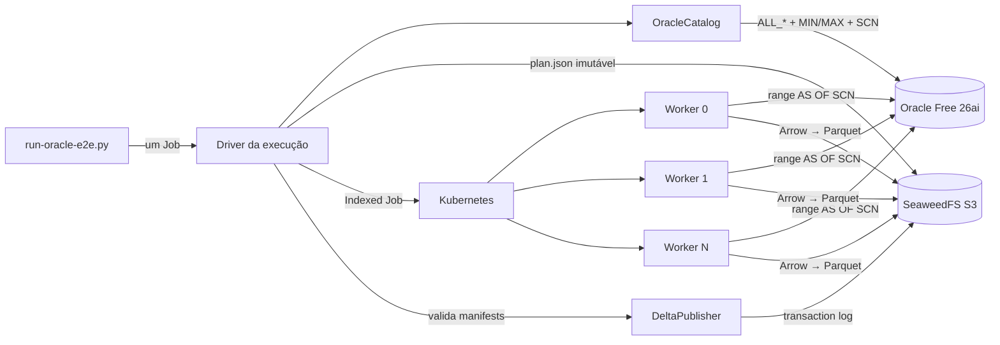
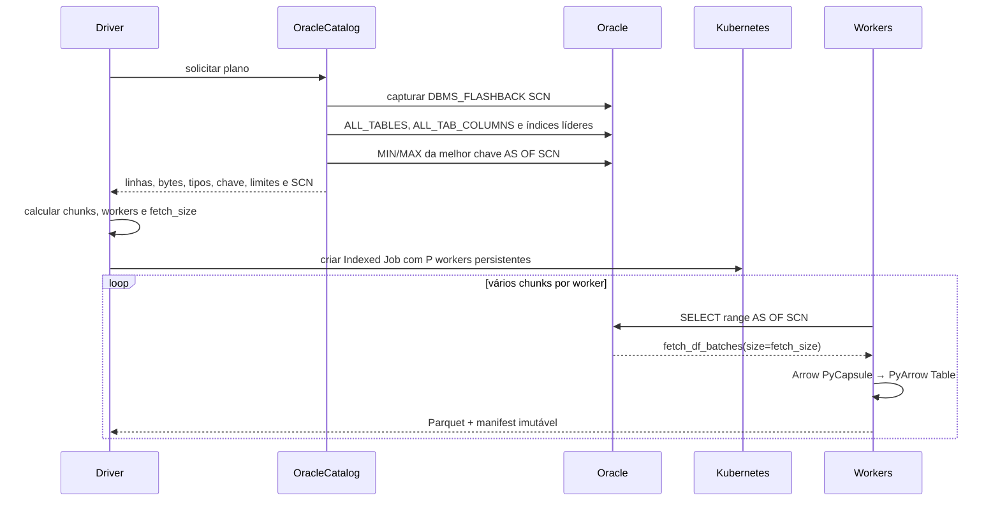

# Ingestão Oracle colunar e distribuída

## Decisão

O primeiro adapter Oracle usa `python-oracledb` em modo Thin e a API
`Connection.fetch_df_batches()`. O driver não requer Oracle Instant Client. A
API produz DataFrames baseados em nanoarrow e expõe o protocolo Arrow PyCapsule;
`pyarrow.table()` recebe esses buffers sem criar uma lista de linhas ou
dicionários Python.

`python-oracledb` e `fetch_df_batches()` cumprem papéis diferentes: o primeiro é
o driver oficial, e o segundo é sua API colunar. O backend registrado no motor é
`oracle_arrow`. Não existe um backend Oracle por linhas nesta etapa, evitando
duplicar código que não participa da hipótese de desempenho.

Referências técnicas:

- [Data Frames no python-oracledb](https://python-oracledb.readthedocs.io/en/stable/user_guide/dataframes.html)
- [API de Connection](https://python-oracledb.readthedocs.io/en/stable/api_manual/connection.html)
- [Oracle AI Database Free](https://www.oracle.com/database/free/)

## Componentes



A execução continua seguindo o modelo Driver Job já adotado pelo motor. Existe
um driver por ingestão; ele cria apenas os workers daquela tabela e termina com
eles. O Airflow não participa do discovery nem precisa receber o plano. Para o
primeiro benchmark, a ferramenta local cria o mesmo Driver Job diretamente.

## Planejamento adaptativo



O catálogo escolhe uma coluna numérica ou temporal que seja a primeira coluna de
um índice `NORMAL` válido. Chave primária, unicidade e não nulabilidade aumentam
a prioridade. O primeiro adapter usa `MIN/MAX` da chave; histogramas Oracle
híbridos e de frequência têm codificação própria e ficam confinados ao plugin
quando forem implementados.

O número de chunks continua sendo calculado por linhas, bytes médios, limite de
conexões, limite de workers e tamanho alvo. O `fetch_size` automático busca cerca
de 16 MiB de dados de origem por batch e respeita os limites do chunk. Dessa
forma, adicionar Oracle não introduz parâmetros manuais por tabela.

## Consistência

O planner captura um SCN antes de calcular os limites. Esse valor entra no
`plan.json`, participa do hash do plano e é reutilizado por todos os workers.
Cada consulta usa:

```sql
SELECT *
FROM "BENCHMARK"."WIDE" AS OF SCN :snapshot_scn
WHERE <predicado do chunk>
```

As faixas são disjuntas e abertas nas extremidades externas, cobrindo inclusive
valores fora de estatísticas antigas. O SCN garante que workers iniciados em
momentos diferentes leiam a mesma versão lógica. Uma origem precisa reter UNDO
suficiente para a duração da carga; caso contrário, o Oracle encerra a consulta
com erro de snapshot antigo e o run não é publicado.

## Caminho de dados e tipos

```text
Oracle wire protocol
  → buffers nanoarrow do python-oracledb
  → Arrow PyCapsule
  → pyarrow.Table
  → dlt resource
  → Parquet no staging S3
  → registro zero-copy no transaction log Delta
```

O adapter cria um `requested_schema` a partir de `ALL_TAB_COLUMNS`. `NUMBER`
com escala zero e precisão até 18 usa `INT64`; decimais usam `DECIMAL128` ou
`DECIMAL256`; textos usam `STRING`; binários usam `BINARY`; datas e timestamps
usam tipos Arrow temporais. Tipos ainda não mapeados falham antes da extração com
uma mensagem que identifica coluna e tipo.

O termo zero-copy se aplica à passagem DataFrame do driver → PyArrow. O protocolo
de rede do Oracle ainda precisa receber e decodificar os dados nos buffers do
driver.

## Laboratório e portabilidade

O Minikube executa Oracle AI Database 26ai Free `23.26.3` em um StatefulSet
efêmero. A variante `faststart` já contém o banco expandido no filesystem da
imagem; montar um PVC vazio em `/opt/oracle/oradata` ocultaria esses arquivos.
O bootstrap recria deterministicamente a tabela antes do benchmark, portanto o
laboratório não depende da persistência da origem. A imagem `gvenzl/oracle-free`
oferece empacotamento comunitário dos binários Oracle Free sem exigir login
interativo no Oracle Container Registry. O banco continua sujeito aos termos do
Oracle Free. Em AKS, o Service pode apontar para
Oracle on-premises, VM, Base Database Service ou Autonomous Database; o adapter
e o contrato da execução permanecem iguais.

O fixture `BENCHMARK.WIDE` contém 1.000.000 de linhas e 48 colunas por padrão:
chaves, números, datas, timestamps, strings largas e cinco colunas esparsas. A
chave primária `ID` fornece o acesso por ranges, e `DBMS_STATS` atualiza linhas,
largura média e índices antes do benchmark.

## Execução do aceite

```bash
# uma vez; instala Docker, suporte a venv, Minikube e kubectl
bash tools/setup-host.sh

# em um terminal novo; build, cluster, storage, Oracle, seed e benchmark
bash tools/bootstrap-oracle-e2e.sh
```

O bootstrap aceita `ROWS` e `WORKERS`, ambos opcionais. Ele sobe um manifesto
mínimo, sem Airflow, SQL Server ou Spark Operator. O último comando imprime o
plano, progresso e resultado, grava uma cópia em
`.local/benchmarks/<run_id>.json` e publica as mesmas séries no Pushgateway. Para
comparar escala horizontal, repita com `WORKERS=1`, `2`, `4` e `8`, recriando a
tabela somente quando o fixture mudar.

As durações por chunk incluem:

| Fase | Conteúdo |
|---|---|
| `source_connect` | conexão Thin com o serviço Oracle |
| `source_schema` | leitura do schema Arrow solicitado |
| `source_execute` | criação/execução inicial do iterador colunar |
| `source_fetch` | rede, decodificação Oracle e produção dos DataFrames |
| `arrow_handoff` | passagem Arrow PyCapsule para `pyarrow.Table` |
| `dlt_arrow_parquet_upload` | Parquet, escrita e upload ainda agrupados pelo encoder |
| `pipeline_setup` | criação local do pipeline dlt |
| `object_listing` | listagem dos objetos produzidos pelo chunk |

O resultado final registra linhas, bytes, arquivos, chunks, workers, throughput,
amplificação de escrita, tempos do motor e todas as durações dos manifests.

## Baseline validado

O aceite `oracle-wide-20260927164511`, executado no Minikube em 27 de setembro
de 2026, usou quatro workers com 1 CPU e 2 GiB cada. O Oracle tinha limite de 2
CPUs e 4 GiB. A validação leu novamente a tabela Delta e confirmou as 1.000.000
de linhas da origem.

| Métrica | Resultado |
|---|---:|
| Colunas / linhas | 48 / 1.000.000 |
| Chunks / workers persistentes | 8 / 4 |
| Linhas por chunk | 125.000 |
| `target_chunk_bytes` adaptativo | 82.482.176 bytes |
| `fetch_size` adaptativo | 25.420 linhas |
| Planejamento | 1,959 s |
| Extração, incluindo criação e acompanhamento dos workers | 12,395 s |
| Validação Delta | 0,121 s |
| Publicação Delta | 0,983 s |
| Tempo total do motor | 15,479 s |
| Throughput do motor | 80.680 linhas/s |
| Parquet publicado | 95.403.310 bytes em 8 arquivos |
| Amplificação de escrita | 1,0 (`zero_copy`) |

Os dois chunks processados sequencialmente por cada worker consumiram entre
4,936 s e 5,158 s. O restante da janela de extração inclui agendamento dos pods,
inicialização dos processos e polling do Job. As somas das fases internas de
chunks se sobrepõem: `pipeline_run`, por exemplo, contém leitura, conversão e
escrita e não deve ser somado novamente a essas subfases.

## Limites desta entrega

- o benchmark cobre tabela integral e estável, sem CDC;
- Oracle `TIMESTAMP WITH TIME ZONE` perde a informação de fuso na representação
  DataFrame atual do driver;
- LOBs acima de 1 GiB não são suportados pela API DataFrame;
- histogramas Oracle e particionamento por ROWID podem ser adicionados dentro do
  plugin sem alterar driver, workers, encoder ou publisher;
- a integração Airflow será feita depois de validar o caminho manual e os
  números do benchmark.
