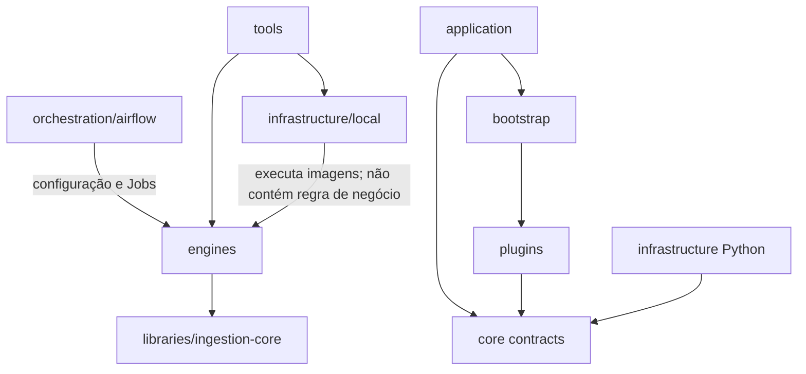

# Organização do repositório

A árvore separa código executável, orquestração, infraestrutura local,
documentação e ferramentas de desenvolvimento.

```text
manage-spark-local/
├── engines/
│   ├── dlt/                       # pacote e imagem do motor dlt distribuído
│   │   ├── src/company_dlt_ingestion/
│   │   │   ├── application/       # casos de uso driver, worker e planejamento
│   │   │   ├── bootstrap/         # registro e composition root
│   │   │   ├── core/              # portas estáveis entre componentes
│   │   │   ├── plugins/           # SQL Server, dlt/Parquet, S3 e Delta
│   │   │   └── infrastructure/    # Kubernetes e métricas
│   │   ├── legacy/                 # benchmark de um pod, mantido para comparação
│   │   └── tests/
│   └── spark/
│       ├── job/                    # wheel Spark e lógica da ingestão JDBC
│       ├── dependencies/           # JARs fixados e checksums
│       ├── Dockerfile              # CompanySparkRuntime
│       └── launcher.py             # carregador genérico de wheel
├── libraries/
│   └── ingestion-core/             # modelos e planner puro compartilhado
├── orchestration/
│   └── airflow/
│       ├── provider/              # operadores, hooks e triggers próprios
│       ├── dags/                  # DAGs de exemplo e benchmark
│       └── Dockerfile
├── infrastructure/
│   └── local/
│       ├── kubernetes/            # manifests do laboratório Minikube
│       └── sqlserver/             # fixture determinística de benchmark
├── tools/                         # build, bootstrap, UI e relatórios locais
├── docs/
│   ├── architecture/
│   ├── benchmarks/
│   ├── operations/
│   └── reference/
├── Makefile
└── versions.env
```

## Regras de dependência



- `engines/dlt` não importa DAGs nem manifests do laboratório.
- `engines/spark` não depende da implementação dlt distribuída.
- `libraries/ingestion-core` não importa Spark, dltHub, Kubernetes, banco ou
  object store; contém somente modelos, configuração e algoritmos de plano.
- `orchestration/airflow/provider` monta recursos Kubernetes, mas não implementa
  leitura de banco nem escrita Delta.
- `infrastructure/local` descreve o laboratório. Trocar Minikube por AKS não
  move código do motor para essa pasta.
- `tools` automatiza ações locais e não é empacotado nas imagens de execução.
- resultados históricos ficam em `docs/benchmarks`; contratos atuais ficam em
  `docs/reference`.

## Comandos principais

| Comando | Efeito |
|---|---|
| `make test` | Executa testes do núcleo, das duas engines e do provider. |
| `make core-build` | Gera o wheel do planner compartilhado. |
| `make spark-job-build` | Gera o wheel executado pelo Spark em `dist/`. |
| `make ingestion-build` | Alias compatível para `spark-job-build`. |
| `make dlt-package-build` | Valida e empacota o motor dlt. |
| `make dlt-build` | Constrói e carrega a imagem do motor no Minikube. |
| `make runtime-build` | Constrói o CompanySparkRuntime. |
| `make airflow-build` | Constrói a imagem local do Airflow com provider e DAGs. |
| `make local-up` | Cria ou atualiza o laboratório completo. |
| `make ui` | Restaura os port-forwards locais. |

Os manifests `platform.yaml` e `observability/manifests.yaml` são gerados por
`tools/render-platform.py` e `tools/render-observability.py`. Mudanças
estruturais devem ser feitas nos geradores e depois renderizadas, evitando
divergência entre fonte e artefato.
