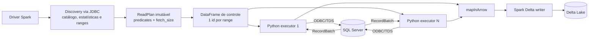

# Spark JDBC × `mssql-python`/Arrow

## Objetivo

Este benchmark compara dois leitores SQL Server dentro do mesmo motor Spark e
mantém invariantes o planner, os ranges, o perfil computacional e o commit
Delta. A decisão é baseada no tempo completo de ingestão, e não apenas no tempo
de materialização de um lote no Python.

Os modos são selecionados por `source.read_mode`:

- `jdbc`: o executor JVM usa o Microsoft JDBC Driver e entrega linhas ao Spark;
- `mssql_arrow`: uma task Python por range usa `mssql-python`, recebe
  `pyarrow.RecordBatch` e os entrega ao Spark por `mapInArrow`.

## Fluxo implementado



O DataFrame de controle não contém dados de negócio. Ele apenas cria o mesmo
número de partições que o plano. Cada task resolve usuário e senha no ambiente
do executor, abre uma conexão, executa seu predicate e produz batches Arrow.
A conexão JDBC usada pelo discovery é fechada antes das tasks, de modo que
`max_connections` continue sendo um limite real da carga na origem.

Esse caminho elimina a criação intermediária de `Row`, `dict` e listas Python.
Ele não é zero-copy de ponta a ponta: o SQL Server envia TDS, o driver ODBC o
decodifica em buffers Arrow, e a fronteira Python/JVM do `mapInArrow` ainda tem
serialização Arrow IPC. O ganho possível vem do formato colunar e do menor
número de objetos Python.

## Planejamento compartilhado

Os dois modos executam o mesmo discovery e recebem o mesmo `ReadPlan`. O número
de ranges respeita conexões, slots e bytes estimados. `fetch_size` é calculado a
partir da largura média da linha para buscar aproximadamente 16 MiB por batch,
limitado entre 1.000 e 100.000 linhas e pelo volume estimado do range. Um inteiro
continua disponível como override; `auto`, `null` ou a ausência do campo ativa o
cálculo.

Não há fallback silencioso de Arrow para JDBC. Um tipo SQL Server não mapeado
falha antes da leitura com o nome da coluna e do tipo. Isso impede um benchmark
misturar caminhos diferentes sem indicar o ocorrido.

## Instrumentação

O resumo JSON e o Pushgateway identificam todas as séries Spark por
`read_mode`. O modo Arrow também publica:

| Métrica | Significado |
|---|---|
| `source_connect_seconds_sum` | soma do tempo de abertura das conexões nas tasks |
| `source_execute_seconds_sum` | soma do tempo até `cursor.execute` retornar |
| `source_fetch_seconds_sum` | soma do tempo bloqueado ao pedir o próximo RecordBatch |
| `arrow_consumer_wait_seconds_sum` | tempo em que o generator ficou suspenso enquanto Spark consumia o batch; inclui fronteira Arrow/Python/JVM e backpressure do writer |
| `task_wall_max` | duração da task mais lenta |
| `source_pipeline_span` | relógio de parede entre a primeira task iniciar e a última terminar |
| `arrow_bytes` | bytes lógicos não comprimidos dos RecordBatches; não representa bytes TDS |

As métricas terminadas em `_sum` são tempo acumulado de executores concorrentes
e podem exceder o relógio de parede. Elas servem para localizar custo. Para
comparar performance, use `throughput_rows_per_second` e `read_write`.

Por padrão, leitura e escrita Delta formam um pipeline lazy do Spark. Isso é o
comportamento produtivo e o principal número do teste. Para diagnóstico,
`benchmark.isolate_io_phases=true` persiste o DataFrame, força um `count()` e
separa:

- `source_materialization`: origem mais conversão e cache do Spark;
- `delta_write_from_cache`: escrita Delta lendo o cache;
- `read_write`: soma das duas fases.

Esse modo muda o caminho, consome memória/disco e não deve substituir o teste
produtivo. O Spark History Server preserva stages, tasks, spill, shuffle, CPU e
I/O após o encerramento; durante a execução, a UI do driver expõe os mesmos
stages.

## Execução direta no cluster

O teste não depende de Airflow. O utilitário de benchmark cria dois
`SparkApplication` sequenciais com nomes e destinos distintos:

```bash
make core-build runtime-build spark-job-build artifacts-publish
.venv/bin/python tools/run-spark-reader-benchmark.py --table wide --profile small
```

Use `--isolate-io-phases` em uma segunda rodada para explicar o resultado. O
utilitário aguarda os estados terminais, coleta o JSON do driver e grava os
resultados em `.local/benchmarks/`. A tabela de origem deve permanecer imutável
durante a rodada; os dois leitores não compartilham uma transação/snapshot.

## Critério de comparação

Uma comparação válida usa a mesma tabela já aquecida, perfil, número de ranges,
`fetch_size`, runtime e storage. Recomenda-se pelo menos cinco rodadas por modo,
alternando a ordem para reduzir o efeito do buffer cache do SQL Server. Compare
mediana e p95 do caminho produtivo. A rodada isolada explica a diferença, mas
não entra no ranking.

Referências: [Spark `mapInArrow`](https://spark.apache.org/docs/latest/api/python/reference/pyspark.sql/api/pyspark.sql.DataFrame.mapInArrow.html),
[mssql-python Arrow](https://github.com/microsoft/mssql-python) e
[Delta Lake](https://docs.delta.io/latest/index.html).

## Resultado E2E local — 2026-10-02

Ambiente: Minikube, perfil `small` (driver 1 core, dois executores de 1 core),
Spark 4.2.0, Delta 4.4.0, `mssql-python` 1.15.0 e PyArrow 25.0.1. A fixture
`wide` contém 1.000.000 linhas, 48 colunas e aproximadamente 496,79 MiB de
páginas alocadas no SQL Server. O planner criou quatro ranges e resolveu
`fetch_size=32.201`, produzindo 32 RecordBatches no caminho Arrow.

### Pipeline produtivo

| Leitor | Leitura + escrita Delta | Throughput | Delta | Checksum integral |
|---|---:|---:|---:|---:|
| JDBC, rodada 1 | 43,54 s | 22.969 linhas/s | 164,84 MiB | `133589279099475762189` |
| JDBC, rodada 2 | 47,30 s | 21.140 linhas/s | 164,84 MiB | `133589279099475762189` |
| `mssql-python`/Arrow | **35,09 s** | **28.499 linhas/s** | 164,04 MiB | `133589279099475762189` |

Nesta amostra, Arrow entregou de 1,24× a 1,35× o throughput JDBC. O checksum
calculado pela leitura completa dos arquivos Delta foi idêntico nos dois modos.
A pequena diferença de bytes decorre da representação física do `datetime2`:
o caminho Arrow preserva timestamp sem timezone (`TimestampNTZType`).

### Rodada diagnóstica com cache

| Leitor | Materialização da origem | Delta a partir do cache | Total diagnóstico |
|---|---:|---:|---:|
| JDBC | 21,64 s | 25,78 s | 47,42 s |
| `mssql-python`/Arrow | **18,84 s** | **24,03 s** | **42,87 s** |

No Arrow, as tasks observaram 605.179.328 bytes lógicos, 8,86 s de fetch
acumulado entre executores, 11,21 s de espera acumulada do consumidor e
11,29 s de span da origem. A materialização completa levou 18,84 s; a diferença
inclui scheduling, conversão na fronteira Python/JVM e persistência no cache.

O caminho SQL/TDS não aparece como gargalo dominante nesta execução. No modo
produtivo, `source_fetch_seconds_sum` foi 8,62 s enquanto
`arrow_consumer_wait_seconds_sum` foi 25,00 s: a maior pressão observada ficou
depois do fetch, na entrega Arrow ao Spark e no backpressure do writer Delta.
Como são somas de tasks concorrentes, esses valores explicam proporções e não
devem ser somados ao relógio de parede.

Esta é uma validação funcional e uma amostra de performance local, não uma série
estatística. O aceite E2E cobriu discovery, quatro conexões/ranges, leitura
Arrow, escrita e commit Delta, `DESCRIBE DETAIL/HISTORY` e leitura integral com
checksum. Os resumos brutos ficam em `.local/benchmarks/` e não são versionados.
