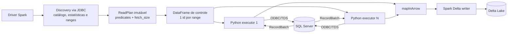

# Spark JDBC × `mssql-python`/Arrow

## Objetivo

Este benchmark compara dois leitores SQL Server dentro do mesmo motor Spark e
mantém invariantes o planner, os ranges, o perfil computacional e o commit
Delta. A decisão é baseada no tempo completo de ingestão, e não apenas no tempo
de materialização de um lote no Python.

Os modos são selecionados por `source.read_mode`:

- `jdbc`: o executor JVM usa o Microsoft JDBC Driver e entrega linhas ao Spark;
- `mssql_arrow`: uma task Python por range usa `mssql-python`, recebe
  `pyarrow.RecordBatch` e os entrega ao Spark por `mapInArrow`.

## Fluxo implementado



O DataFrame de controle não contém dados de negócio. Ele apenas cria o mesmo
número de partições que o plano. Cada task resolve usuário e senha no ambiente
do executor, abre uma conexão, executa seu predicate e produz batches Arrow.
A conexão JDBC usada pelo discovery é fechada antes das tasks, de modo que
`max_connections` continue sendo um limite real da carga na origem.

Esse caminho elimina a criação intermediária de `Row`, `dict` e listas Python.
Ele não é zero-copy de ponta a ponta: o SQL Server envia TDS, o driver ODBC o
decodifica em buffers Arrow, e a fronteira Python/JVM do `mapInArrow` ainda tem
serialização Arrow IPC. O ganho possível vem do formato colunar e do menor
número de objetos Python.

## Planejamento compartilhado

Os dois modos executam o mesmo discovery e recebem o mesmo `ReadPlan`. O número
de ranges respeita conexões, slots e bytes estimados. `fetch_size` é calculado a
partir da largura média da linha para buscar aproximadamente 16 MiB por batch,
limitado entre 1.000 e 100.000 linhas e pelo volume estimado do range. Um inteiro
continua disponível como override; `auto`, `null` ou a ausência do campo ativa o
cálculo.

Não há fallback silencioso de Arrow para JDBC. Um tipo SQL Server não mapeado
falha antes da leitura com o nome da coluna e do tipo. Isso impede um benchmark
misturar caminhos diferentes sem indicar o ocorrido.

## Instrumentação

O resumo JSON e o Pushgateway identificam todas as séries Spark por
`read_mode`. O modo Arrow também publica:

| Métrica | Significado |
|---|---|
| `source_connect_seconds_sum` | soma do tempo de abertura das conexões nas tasks |
| `source_execute_seconds_sum` | soma do tempo até `cursor.execute` retornar |
| `source_fetch_seconds_sum` | soma do tempo bloqueado ao pedir o próximo RecordBatch |
| `prefetch_queue_wait_seconds_sum` | tempo em que o consumidor espera a fila limitada receber o próximo evento do produtor ODBC |
| `arrow_consumer_wait_seconds_sum` | tempo em que o generator ficou suspenso enquanto Spark consumia o batch; inclui fronteira Arrow/Python/JVM e backpressure do writer |
| `task_wall_max` | duração da task mais lenta |
| `source_pipeline_span` | relógio de parede entre a primeira task iniciar e a última terminar |
| `arrow_bytes` | bytes lógicos não comprimidos dos RecordBatches; não representa bytes TDS |

As métricas terminadas em `_sum` são tempo acumulado de executores concorrentes
e podem exceder o relógio de parede. Elas servem para localizar custo. Para
comparar performance, use `throughput_rows_per_second` e `read_write`.

Por padrão, leitura e escrita Delta formam um pipeline lazy do Spark. Isso é o
comportamento produtivo e o principal número do teste. Para diagnóstico,
`benchmark.isolate_io_phases=true` persiste o DataFrame, força um `count()` e
separa:

- `source_materialization`: origem mais conversão e cache do Spark;
- `delta_write_from_cache`: escrita Delta lendo o cache;
- `read_write`: soma das duas fases.

Esse modo muda o caminho, consome memória/disco e não deve substituir o teste
produtivo. O Spark History Server preserva stages, tasks, spill, shuffle, CPU e
I/O após o encerramento; durante a execução, a UI do driver expõe os mesmos
stages.

## Execução direta no cluster

O teste não depende de Airflow. O utilitário de benchmark cria dois
`SparkApplication` sequenciais com nomes e destinos distintos:

```bash
make core-build runtime-build spark-job-build artifacts-publish
.venv/bin/python tools/run-spark-reader-benchmark.py --table wide --profile small
```

Use `--isolate-io-phases` em uma segunda rodada para explicar o resultado. O
utilitário aguarda os estados terminais, coleta o JSON do driver e grava os
resultados em `.local/benchmarks/`. A tabela de origem deve permanecer imutável
durante a rodada; os dois leitores não compartilham uma transação/snapshot.

## Critério de comparação

Uma comparação válida usa a mesma tabela já aquecida, perfil, número de ranges,
`fetch_size`, runtime e storage. Recomenda-se pelo menos cinco rodadas por modo,
alternando a ordem para reduzir o efeito do buffer cache do SQL Server. Compare
mediana e p95 do caminho produtivo. A rodada isolada explica a diferença, mas
não entra no ranking.

Referências: [Spark `mapInArrow`](https://spark.apache.org/docs/latest/api/python/reference/pyspark.sql/api/pyspark.sql.DataFrame.mapInArrow.html),
[mssql-python Arrow](https://github.com/microsoft/mssql-python) e
[Delta Lake](https://docs.delta.io/latest/index.html).

## Resultado E2E local — 2026-10-02

Ambiente: Minikube, perfil `small` (driver 1 core, dois executores de 1 core),
Spark 4.2.0, Delta 4.4.0, `mssql-python` 1.15.0 e PyArrow 25.0.1. A fixture
`wide` contém 1.000.000 linhas, 48 colunas e aproximadamente 496,79 MiB de
páginas alocadas no SQL Server. A baseline anterior criou quatro ranges e
resolveu `fetch_size=32.201`, produzindo 32 RecordBatches no caminho Arrow.
As rodadas desta alteração habilitam prefetch com fila limitada a um batch por
task e alinham o número de ranges ao número de slots por padrão. O teste de
32 MiB terminou com executores `OOMKilled` tanto no perfil pequeno (1 GiB por
executor mais 512 MiB de overhead) quanto no médio (2 GiB mais 512 MiB). Por
isso, o default adaptativo permanece em 16 MiB; 32 MiB continua configurável,
mas não é adequado ao orçamento de memória deste laboratório.

### Pipeline produtivo

| Leitor | Leitura + escrita Delta | Throughput | Delta | Checksum integral |
|---|---:|---:|---:|---:|
| JDBC, rodada 1 | 43,54 s | 22.969 linhas/s | 164,84 MiB | `133589279099475762189` |
| JDBC, rodada 2 | 47,30 s | 21.140 linhas/s | 164,84 MiB | `133589279099475762189` |
| `mssql-python`/Arrow | **35,09 s** | **28.499 linhas/s** | 164,04 MiB | `133589279099475762189` |

Nesta amostra, Arrow entregou de 1,24× a 1,35× o throughput JDBC. O checksum
calculado pela leitura completa dos arquivos Delta foi idêntico nos dois modos.
A pequena diferença de bytes decorre da representação física do `datetime2`:
o caminho Arrow preserva timestamp sem timezone (`TimestampNTZType`).

### Rodada diagnóstica com cache

| Leitor | Materialização da origem | Delta a partir do cache | Total diagnóstico |
|---|---:|---:|---:|
| JDBC | 21,64 s | 25,78 s | 47,42 s |
| `mssql-python`/Arrow | **18,84 s** | **24,03 s** | **42,87 s** |

No Arrow, as tasks observaram 605.179.328 bytes lógicos, 8,86 s de fetch
acumulado entre executores, 11,21 s de espera acumulada do consumidor e
11,29 s de span da origem. A materialização completa levou 18,84 s; a diferença
inclui scheduling, conversão na fronteira Python/JVM e persistência no cache.

### Rodadas com prefetch limitado e planejamento por slots

Todas as rodadas abaixo ingeriram 1.000.000 de linhas e 48 colunas, usaram
`mssql-python` 1.15.0, Spark 4.2.0, Delta 4.4.0 e o perfil `small`. O batch
efetivo foi 16 MiB, resultando em `fetch_size=32.201` e 32 RecordBatches.
O checksum integral foi `133589279099475762189` em todas as rodadas; os arquivos
Delta tinham aproximadamente 164 MiB.

| Slots / ranges | Leitura + escrita Delta | Throughput | Tasks Arrow | Fetch acumulado | Espera na fila do prefetch | Espera do consumidor |
|---:|---:|---:|---:|---:|---:|---:|
| 2 / 2 | 33,14 s | 30.178 linhas/s | 2 | 11,59 s | 1,26 s | 29,25 s |
| 2 / 4 (oversubscription 2) | 36,54 s | 27.370 linhas/s | 4 | 13,46 s | 2,11 s | 32,51 s |

O teste de 2 ranges terminou com 2 arquivos e 171.955.337 bytes Delta; o de 4
ranges terminou com 4 arquivos e 172.003.431 bytes. A segunda execução também
valida que o override de oversubscription mantém quatro ranges executados em
dois executores reutilizados, sem criar um pod por range. Nesta amostra, quatro
ranges não melhoraram o tempo e produziram arquivos adicionais.

Comparada à baseline Arrow anterior (4 ranges, sem prefetch, 35,09 s), a rodada
de 2 ranges levou 5,6% menos tempo, enquanto a rodada de 4 ranges com prefetch
levou 4,1% mais. Como cada combinação teve uma única execução e a cache do
SQL Server/S3 local pode variar, isso não comprova ganho estatístico do
prefetch. As métricas mostram cerca de 1–2 s de espera total na fila, mas ainda
29–33 s de tempo acumulado em que o generator fica suspenso sob consumo do
Spark; conversão na fronteira Arrow/Python/JVM e backpressure da escrita Delta
seguem como custos relevantes.

Os JSON completos destas rodadas ficam em `.local/benchmarks/` (não versionados).

### Confirmação do padrão no perfil médio

Depois de reconstruir a imagem runtime com o default de 16 MiB, rodei novamente
o caso sem override de batch no perfil `medium`, mantendo duas tarefas
planejadas. O E2E concluiu em 24,40 s (40.984 linhas/s), com duas tasks Arrow,
32 batches, 171.955.337 bytes Delta, dois arquivos e o mesmo checksum integral.
As métricas registraram 6,88 s de fetch acumulado, 1,35 s na fila de prefetch,
19,65 s de espera acumulada do consumidor e 12,44 s de span das tasks.

Uma repetição no perfil `small` com o mesmo default de 16 MiB terminou em
`OOMKilled`, enquanto outra repetição `small` havia passado. Isso indica pouca
margem de memória e variabilidade no limite de 1 GiB de heap + 512 MiB de
overhead, não uma garantia de que esse perfil suporta a fixture wide. Para a
fixture de 1 milhão de linhas, o perfil `medium` é a configuração validada para
execuções reproduzíveis; ainda assim, 32 MiB excedeu a memória até nesse perfil.

### Separação das fases I/O — 2026-10-02

Rodei `isolate_io_phases=true` no perfil `medium`, com duas tasks, duas ranges e
batch de 16 MiB. A validação Delta concluiu com 1.000.000 de linhas e o checksum
integral `133589279099475762189`.

| Fase | Tempo |
|---|---:|
| Materialização da origem Arrow no cache Spark | 13,31 s |
| Escrita Delta lendo o cache | 17,35 s |
| Total diagnóstico | 30,66 s |

A escrita a partir do cache levou cerca de 30% mais tempo que a materialização
da origem nesta rodada, tornando Delta/SeaweedFS o próximo alvo de investigação.
Isso não prova que a escrita seja o gargalo no pipeline produtivo: o modo
diagnóstico muda o caminho ao persistir e reler o DataFrame, e o Spark executou
retries de tasks durante a rodada. O pipeline produtivo correspondente no perfil
`medium` havia levado 24,40 s; não se deve comparar 30,66 s como regressão direta.

O driver concluiu a escrita e o readback, mas o recurso SparkApplication ficou
em `RunningWithBelowThresholdExecutors` após o término do driver. O resumo foi
preservado diretamente dos logs do driver em
`.local/benchmarks/spark-arrow-wide-20261002185107.json`.

### Matriz do writer e otimização dos arquivos — 2026-10-02

A versão 0.9.0 materializa uma vez o DataFrame e grava variantes isoladas em
URIs diferentes. A rodada usou duas tasks, duas partições, batch Arrow de
16 MiB e executores com 3 GiB de heap + 1 GiB de overhead para impedir que o
cache diagnóstico contaminasse os números com `OOMKilled`. Todas as variantes
produziram 1.000.000 de linhas e o checksum
`133589279099475762189`; não houve perda de executor ou `FetchFailed`.

| Variante na mesma aplicação | Escrita | Arquivos | Bytes Parquet |
|---|---:|---:|---:|
| Delta + Snappy, 2 partições | 17,69 s | 2 | 171.955.337 |
| Parquet + Snappy, 2 partições | 6,09 s | 2 | 171.953.401 |
| Delta + Zstandard, 2 partições | 8,38 s | 2 | 88.997.201 |
| Delta sem compressão, 2 partições | 6,74 s | 2 | 269.577.612 |
| Delta + Snappy, 1 partição | 11,54 s | 1 | 171.958.352 |

Esses tempos dentro da mesma aplicação mostram o custo de inicialização da
primeira escrita Delta: Snappy foi a primeira variante. Por isso, cada codec
também foi executado como único writer em aplicações novas, com o mesmo cache:

| Writer frio | Materialização | Escrita Delta | Bytes | Arquivos |
|---|---:|---:|---:|---:|
| Snappy, 2 arquivos | 12,89 s | 17,69 s | 171.955.337 | 2 |
| Zstandard, 2 arquivos | 12,77 s | 17,72 s | 88.997.201 | 2 |
| Sem compressão, 2 arquivos | 12,53 s | 17,28 s | 269.577.612 | 2 |
| Snappy, 1 arquivo | 13,38 s | 22,16 s | 171.958.352 | 1 |

Retirar a compressão economizou apenas 0,42 s de escrita e aumentou a saída em
56,8% sobre Snappy. Um arquivo foi 25,2% mais lento que dois. Zstandard teve o
mesmo tempo frio de Snappy dentro da variação da rodada e reduziu os bytes em
48,2%. O perfil S3A com multipart de 64 MiB e buffer em disco reduziu a escrita
Zstandard de 17,72 s para 17,35 s (2,1%); uma única amostra não diferencia esse
resultado de ruído, portanto ele não virou default.

No pipeline produtivo, executado sem cache diagnóstico e sem tuning S3A, os
defaults finais (Zstandard e alvo adaptativo de 128 MiB) concluíram em 23,38 s,
42.765 linhas/s, dois arquivos e 88.997.201 bytes. A comparação controlada
Snappy, com os mesmos recursos, levou 23,71 s e gerou 171.955.337 bytes. O ganho
de tempo foi apenas 1,4%, mas a redução de armazenamento e tráfego foi 48,2%.
O planner estimou duas saídas e preservou as duas partições, sem shuffle.

Resultados brutos principais:

- `.local/benchmarks/spark-arrow-wide-20261002190502.json`: matriz completa;
- `.local/benchmarks/spark-arrow-wide-20261002191331.json`: pipeline Snappy;
- `.local/benchmarks/spark-arrow-wide-20261002191447.json`: Zstandard + S3A multipart;
- `.local/benchmarks/spark-arrow-wide-20261002191714.json`: defaults finais.

O caminho SQL/TDS não aparece como gargalo dominante nesta execução. No modo
produtivo, `source_fetch_seconds_sum` foi 8,62 s enquanto
`arrow_consumer_wait_seconds_sum` foi 25,00 s: a maior pressão observada ficou
depois do fetch, na entrega Arrow ao Spark e no backpressure do writer Delta.
Como são somas de tasks concorrentes, esses valores explicam proporções e não
devem ser somados ao relógio de parede.

Esta é uma validação funcional e uma amostra de performance local, não uma série
estatística. O aceite E2E cobriu discovery, quatro conexões/ranges, leitura
Arrow, escrita e commit Delta, `DESCRIBE DETAIL/HISTORY` e leitura integral com
checksum. Os resumos brutos ficam em `.local/benchmarks/` e não são versionados.

### Escrita direta PyArrow e commit Delta por manifesto — 2026-10-02

A arquitetura, a explicação do ganho e os caminhos de integração com Unity
Catalog estão consolidados em
[`mssql-pyarrow-delta-rs.md`](../architecture/mssql-pyarrow-delta-rs.md).

Uma comparação controlada executou os writers Spark e PyArrow em aplicações
novas, com o mesmo runtime 0.4.0, wheel 0.10.0, dois executores, duas partições,
3 GiB de heap + 1 GiB de overhead por executor e compressão Zstandard. Os dois
caminhos produziram 1.000.000 de linhas e o mesmo checksum
`133589279099475762189`. Não houve perda de executor, `OOMKilled` ou
`FetchFailed`.

| Writer | Leitura até commit Delta | Ciclo total do motor | Maior task | Arquivos | Bytes |
|---|---:|---:|---:|---:|---:|
| Spark Delta | 24,39 s | 62,47 s | 13,49 s | 2 | 88.997.201 |
| PyArrow + delta-rs | 5,91 s | 54,50 s | 3,84 s | 2 | 99.481.474 |

O caminho direto reduziu o tempo até o dado estar publicado em Delta em 75,8%,
um speedup de 4,12 vezes. A maior task caiu 71,6%. O arquivo PyArrow ficou 11,8%
maior, embora use o mesmo codec, devido às diferenças de layout, estatísticas e
configuração entre os encoders Parquet.

No writer direto, extração, codificação e upload consumiram 5,81 s e o commit
Delta por manifesto consumiu 0,10 s. As somas das duas tasks foram 5,62 s no
fetch, 2,57 s na codificação Parquet e 0,36 s no upload. Essas etapas se
sobrepõem pelo prefetch e pela concorrência entre executores, portanto as somas
não representam tempo de parede. O upload deixou de ser um gargalo relevante;
fetch e codificação concentram o trabalho útil restante.

O ciclo completo melhorou somente 12,8%, de 62,47 s para 54,50 s, porque a
coleta síncrona de métricas consumiu 26,39 s e o readback integral com checksum,
6,44 s, depois do commit. Portanto, o caminho crítico da ingestão foi reduzido,
mas o processo ainda espera validações e consultas Spark posteriores. Em
produção, o SLA de publicação deve terminar no commit durável e as validações
integrais devem ser configuráveis ou executadas fora desse caminho; o benchmark
continua usando a validação completa para comprovar equivalência.

Resultados brutos:

- `.local/benchmarks/spark-arrow-wide-20261002220007.json`: Spark Delta;
- `.local/benchmarks/spark-arrow-wide-20261002220136.json`: PyArrow + delta-rs.
